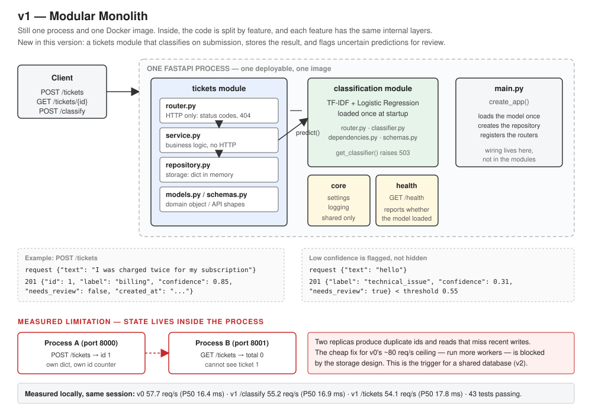

# AI Support Platform

An AI-powered support and knowledge automation platform, built as one continuously evolving
system. Each version starts from a measured limitation of the previous one and introduces the
smallest architectural change that solves it.

**Current version: v1 — Modular Monolith** (branch `v1-modular-monolith`)

## 1. Project Overview

The platform receives support requests, classifies them, stores them, and — in later versions —
searches an organizational knowledge base, generates grounded answers, and performs controlled
actions such as creating or updating tickets.

The engineering goal is a production-style AI system whose every component can be justified:
what problem forced it in, what it costs, and what happens when it fails. The architecture
history is preserved as branches (`v0-baseline`, `v1-modular-monolith`, ...) and documented in
[`docs/versions/`](docs/versions/) and [`docs/adr/`](docs/adr/).

## 2. Problem Being Solved

Support teams receive a stream of free-text requests that someone has to read and route to the
right team. That work is repetitive, slow, and error-prone. The platform routes each request
automatically, keeps a record of what it decided, and makes its uncertainty visible so a human
can step in where the model is unsure rather than everywhere.

## 3. Main AI Capabilities

| Capability | Status | Since |
|---|---|---|
| Ticket classification (billing / technical issue / account access / feature request) | Available | v0 |
| Automatic classification on ticket submission, with the result stored | Available | v1 |
| Low-confidence predictions flagged for human review | Available | v1 |
| Knowledge base search and retrieval-augmented answers | Planned | — |
| Controlled actions (create / update tickets) with human approval | Planned | — |
| Model evaluation, monitoring, and safe rollout | Planned | — |

## 4. Current Architecture



One FastAPI process, organised internally by feature. A TF-IDF + Logistic Regression classifier
is loaded once at startup and runs inside the process. Tickets are held in an in-memory
repository. There is no database, cache, queue, or external service yet.

```
app/
├── main.py          create_app(): lifespan, wiring, router registration
├── core/            settings and logging
├── health/          GET /health
├── classification/  the model + POST /classify
└── tickets/         POST/GET /tickets  (router → service → repository)
```

## 5. Request Flow

`POST /tickets`:

1. Pydantic validates the body: required, 3–5000 characters, not blank. Invalid → 422.
2. FastAPI resolves the endpoint's dependencies: repository, classifier, then `TicketService`.
   If the model is not loaded, `get_classifier` raises 503 before any logic runs.
3. `TicketService.submit` classifies the text, compares the confidence against
   `LOW_CONFIDENCE_THRESHOLD`, builds a `Ticket`, and hands it to the repository.
4. The repository assigns an id under a lock and stores the ticket.
5. Response: 201 with `{id, text, label, confidence, model_version, needs_review, created_at}`.
   An unexpected exception → 500 with a generic message; the traceback goes to the log.

`GET /tickets/{id}` returns 200 or 404. `GET /tickets` accepts `label` and `needs_review`
filters and returns `{total, items}`. `POST /classify` classifies without storing anything.
`GET /health` reports whether the model is loaded.

## 6. AI Flow

Offline (before the server starts):

```
ml/data/tickets.csv  →  ml/train.py  →  models/ticket_classifier.joblib + models/metrics.json
   200 labelled            TF-IDF + Logistic        pipeline + model_version + labels
   tickets                 Regression, 75/25         + trained_at + sklearn_version
                           held-out evaluation
```

Online (per request):

```
text → TF-IDF features (1–3 grams) → Logistic Regression → probabilities → argmax
     → label + confidence
     → confidence < threshold ? needs_review = true : false
```

The classifier has no "unknown" class: every input receives one of four labels. The confidence
threshold is what keeps an uncertain guess from being acted on silently
([ADR-006](docs/adr/ADR-006-low-confidence-human-review.md)).

## 7. Data Flow

Submitted tickets are stored in an in-memory repository that lives inside the API process.
They survive between requests but **not** across restarts, and they are not shared between
processes. `POST /classify` stores nothing. The only durable artifacts are the model file and
its metrics, produced at training time.

## 8. Technology Stack

| Layer | Technology | Why (short) |
|---|---|---|
| Language | Python 3.12 | Standard for AI engineering |
| API | FastAPI + Uvicorn | Validation, generated docs, dependency injection, sync endpoints in a thread pool |
| Validation / config | Pydantic, pydantic-settings | Typed request/response models; settings from environment variables |
| Model | scikit-learn (TF-IDF + Logistic Regression), joblib | Kilobyte-sized, ~2 ms CPU inference, standard metrics |
| Storage | In-memory dict behind a repository interface | Deliberate placeholder; see [ADR-005](docs/adr/ADR-005-repository-pattern-in-memory.md) |
| Tests | pytest, httpx | In-process API tests plus business-logic tests with no HTTP and no model |
| Container | Docker | Reproducible runtime; model trained inside the image |

Dependencies: `requirements.in` lists direct dependencies; `requirements.txt` is the frozen,
pinned set used for installs and the Docker build.

## 9. Current Version

**v1 — Modular Monolith.** See [docs/versions/v1-modular-monolith.md](docs/versions/v1-modular-monolith.md)
for the full problem / solution / trade-off / measurement write-up, and
[docs/versions/v1-modular-monolith/README.md](docs/versions/v1-modular-monolith/README.md) for a
short guide.

## 10. Version Evolution

| Version | Branch | Problem it solves | Status |
|---|---|---|---|
| v0 | `v0-baseline` | A support ticket needs to be classified over HTTP with a free, local model | Complete |
| v1 | `v1-modular-monolith` | Tickets must be stored and uncertainty made visible; the flat layout has nowhere to put business logic | Complete |
| v2 | `v2-postgresql` | State lives inside the process: data is lost on restart and cannot be shared between replicas | Next |

Old branches remain on GitHub as engineering history.

## 11. How to Run

Requirements: Python 3.11 or 3.12, or Docker.

```bash
python -m venv .venv
source .venv/bin/activate        # Windows PowerShell: .\.venv\Scripts\Activate.ps1
pip install -r requirements.txt
python ml/train.py               # produces models/ticket_classifier.joblib
uvicorn app.main:app
```

Interactive API docs: http://127.0.0.1:8000/docs

```bash
curl -X POST http://127.0.0.1:8000/tickets -H "Content-Type: application/json" -d '{"text": "I was charged twice for my subscription"}'
curl "http://127.0.0.1:8000/tickets?needs_review=true"
```

Docker:

```bash
docker build -t ai-support-platform:v1 .
docker run --rm -p 8000:8000 ai-support-platform:v1
```

Configuration (environment variables or `.env`, see `.env.example`):

| Variable | Default | Meaning |
|---|---|---|
| `APP_NAME` | `AI Support Platform` | Title shown in API docs |
| `CLASSIFIER_PATH` | `models/ticket_classifier.joblib` | Model artifact to load at startup |
| `LOW_CONFIDENCE_THRESHOLD` | `0.55` | Predictions below this are flagged `needs_review` |
| `LOG_LEVEL` | `INFO` | Python logging level |

## 12. Testing

```bash
pytest -v
```

43 tests:

- **API tests** — `/health`, `/classify`, `/tickets` create / read / list / filter.
- **Failure cases** — invalid input (missing, empty, blank, too short, too long, wrong type),
  unknown ticket id (404), non-numeric id (422), model file missing (503), prediction crash
  (500, generic message to the client).
- **Business-logic tests** — `TicketService` with a fake classifier and an empty repository:
  no HTTP, no server, no model file. Includes threshold boundary cases and error propagation.
- **A limitation test** — asserts that tickets do *not* survive a new application instance,
  documenting the in-memory store's behaviour rather than hiding it.

## 13. Evaluation

`ml/train.py` holds out 25% of the dataset and reports accuracy, macro F1 and a per-class
precision/recall/F1 table; results are saved to `models/metrics.json`.

Current model (`v0.1.0`, 200 rows, 150 train / 50 test, measured locally):

| Metric | Value |
|---|---|
| Accuracy | 0.90 |
| Macro F1 | 0.90 |
| F1 — account_access / billing / feature_request / technical_issue | 0.81 / 0.92 / 1.00 / 0.87 |

The dataset is small and hand-written; these numbers are optimistic relative to real customer
text and are treated as a baseline, not a claim. The model has no out-of-scope class: the input
`"hello"` is classified as `technical_issue` at 0.31 confidence, which is why v1 flags
low-confidence results instead of trusting them.

## 14. Architecture Decisions

- [ADR-001 — Classical ML model as the baseline classifier](docs/adr/ADR-001-classical-ml-baseline-classifier.md)
- [ADR-002 — Serve the model inside the API process](docs/adr/ADR-002-in-process-model-serving.md)
- [ADR-003 — Train the model inside the Docker image build](docs/adr/ADR-003-model-trained-in-docker-image.md)
- [ADR-004 — Modular monolith structure and dependency injection](docs/adr/ADR-004-modular-monolith-structure.md)
- [ADR-005 — Repository pattern with an in-memory implementation](docs/adr/ADR-005-repository-pattern-in-memory.md)
- [ADR-006 — Flag low-confidence predictions for human review](docs/adr/ADR-006-low-confidence-human-review.md)

## 15. Performance / Scaling Notes

Measured locally (Windows 11 laptop, single uvicorn process, loopback) with
`scripts/measure_latency.py`, 1000 requests per run, **all three runs in one session**:

| Version | Endpoint | Throughput | P50 | P95 | P99 |
|---|---|---|---|---|---|
| v0 | `/classify` | 57.7 req/s | 16.4 ms | 23.0 ms | 38.1 ms |
| v1 | `/classify` | 55.2 req/s | 16.9 ms | 26.8 ms | 41.2 ms |
| v1 | `/tickets` | 54.1 req/s | 17.8 ms | 24.3 ms | 37.5 ms |

The v1 restructuring costs about 0.5 ms at P50 — one dependency resolution per request. Storing
a ticket costs roughly another 1.4 ms. Model inference alone is 1.7 ms, so most of a request is
the HTTP stack, not the model.

**Measurement hygiene.** The same v0 code measured 81.7 req/s on one day and 57.7 req/s five
days later on the same laptop — a 29% difference caused by machine state, not by code.
Benchmarks in this project are only compared when taken in the same session on the same
machine; cross-day comparisons are reported as invalid rather than as regressions.

**Known limitations, both measured:**

1. *Serial inference.* Throughput has a ceiling regardless of client concurrency, because
   prediction is CPU-bound in a single process and Python's GIL prevents parallel execution in
   the thread pool. At concurrency 10, requests queue rather than scale.
2. *State inside the process.* Running two servers on ports 8000 and 8001 showed a ticket
   posted to one returning `id 1`, while the other reported `total 0`. Two replicas produce
   duplicate ids and reads that miss recent writes — so the cheap fix for limitation 1 (more
   worker processes) is blocked by the storage design. This is the trigger for the next version.

Theoretical scaling beyond this machine is discussed per version in `docs/versions/`; none of
it has been measured.
