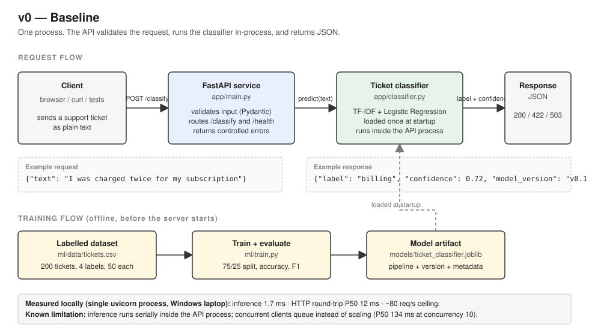

# Version v0 — Baseline

Branch: `v0-baseline`
Model version: `v0.1.0`
Status: complete

## Problem

A support team receives free-text requests ("I was charged twice", "the app crashes on upload")
and has to route each one to the right team: billing, technical, account access, or product.
Reading and routing by hand is slow and repetitive.

The first requirement is deliberately small: **an HTTP service that accepts the text of a support
ticket and returns its category.**

## Current Architecture

There was no architecture before this version. v0 establishes the baseline that every later
version is measured against.

## Why the Old Design Is Not Enough

Not applicable — nothing existed. The reason to build a baseline instead of a "proper" system
straight away is that every later architectural change must be justified by a *measured*
limitation of the version before it. Without v0 there is nothing to measure.

## Solution

```
Client → FastAPI → Ticket classifier (in-process) → JSON response
```



Components:

| Component | File | Purpose |
|---|---|---|
| Dataset | `ml/data/tickets.csv` | 200 hand-written support tickets, 50 per label |
| Training script | `ml/train.py` | Trains TF-IDF + Logistic Regression, evaluates on a held-out split, saves the artifact and metrics |
| Model artifact | `models/ticket_classifier.joblib` | The trained pipeline plus metadata (model version, labels, training time, scikit-learn version) |
| Classifier wrapper | `app/classifier.py` | Loads the artifact and exposes `predict(text)` — the only thing the API talks to |
| API | `app/main.py`, `app/schemas.py`, `app/config.py` | `POST /classify`, `GET /health`; validation, error handling, configuration from environment |
| Tests | `tests/` | 16 tests: HTTP contract, invalid input, model missing, model crash, model behaviour |
| Measurement | `scripts/measure_latency.py` | Latency percentiles and throughput against the running API |
| Container | `Dockerfile` | Builds dependencies, trains the model inside the image, serves on port 8000 |

Endpoints:

- `POST /classify` — body `{"text": "..."}` → `{"label": "...", "confidence": 0.0–1.0, "model_version": "v0.1.0"}`
- `GET /health` — `{"status": "ok", "model_loaded": true|false, "model_version": "..."|null}`

## Why This Solution?

**Model: TF-IDF + Logistic Regression (scikit-learn).** Options considered:

| Option | Why not (for a baseline) |
|---|---|
| Zero-shot transformer from Hugging Face | 300 MB–1.6 GB download, PyTorch dependency, hundreds of ms per request on CPU. Heavier than the problem needs today. |
| Small local LLM | Several GB, slow on CPU, free-text output that is hard to evaluate for a fixed-category task. |
| **TF-IDF + Logistic Regression** | Model file is kilobytes, prediction takes ~2 ms, easy to evaluate with standard metrics, no GPU, no downloads. Weak on wording it has never seen — an accepted, documented limitation. |

**API: FastAPI.** Automatic input validation through Pydantic, generated interactive docs, small
footprint, and sync endpoints run in a thread pool so CPU-bound prediction does not block the
server loop.

**Model in the API process.** The simplest thing that works: one process, one file to load, no
network hop between API and model. Correct while inference is cheap (see Measurements).

**Model trained inside the Docker image.** Guarantees the model is produced with exactly the
library versions that serve it. This matters: during development the model was accidentally
trained with scikit-learn 1.4.2 and loaded with 1.9.1, producing `InconsistentVersionWarning`.
Pickled models are tied to the library version that wrote them.

See ADRs: [ADR-001](../adr/ADR-001-classical-ml-baseline-classifier.md),
[ADR-002](../adr/ADR-002-in-process-model-serving.md),
[ADR-003](../adr/ADR-003-model-trained-in-docker-image.md).

## New Trade-offs

- **Model lives inside the API process.** API and model cannot be scaled or deployed separately.
- **Inference is serial.** One process; Python's GIL prevents thread-level parallelism for CPU work.
- **Model and code ship together.** A new model requires a new image build.
- **Model version is a hard-coded string.** No registry, no experiment tracking.
- **Dataset is tiny and hand-written.** Metrics are optimistic compared to real customer text.
- **No persistence.** Nothing is stored; every request is forgotten after the response.
- **No authentication, no rate limiting.** Anyone who can reach the port can call it.

## What Changed

Everything is new in this version:

- Repository layout: `app/`, `ml/`, `models/`, `tests/`, `scripts/`, `docs/`
- Dependency management: `requirements.in` (direct dependencies) + `requirements.txt` (frozen)
- Configuration through environment variables (`app/config.py`, `.env.example`)
- Application factory (`create_app`) so tests can build isolated app instances
- Failure handling: model file missing → server starts, `/health` reports `model_loaded: false`, `/classify` returns 503; prediction crash → 500 with a generic message, full traceback in the log; invalid input → 422
- Model artifact records `sklearn_version` so environment mismatches are visible
- Latency measurement script

## How to Test

From the repository root, with the virtual environment active.

Train the model (required before the API or tests can run):

```bash
python ml/train.py
```

Run the tests:

```bash
pytest -v
```

Start the API:

```bash
uvicorn app.main:app
```

Call it (Linux / WSL / Git Bash):

```bash
curl http://127.0.0.1:8000/health
curl -X POST http://127.0.0.1:8000/classify -H "Content-Type: application/json" -d '{"text": "I was charged twice this month"}'
```

Windows PowerShell:

```powershell
Invoke-RestMethod http://127.0.0.1:8000/health
Invoke-RestMethod -Method Post -Uri http://127.0.0.1:8000/classify -ContentType "application/json" -Body '{"text": "I was charged twice this month"}'
```

Measure latency (server running, started without `--reload`):

```bash
python scripts/measure_latency.py --requests 1000 --concurrency 1
python scripts/measure_latency.py --requests 1000 --concurrency 10
```

Inference time without HTTP:

```bash
python -c "import timeit; from app.classifier import TicketClassifier; c = TicketClassifier.load('models/ticket_classifier.joblib'); n=1000; t = timeit.timeit(lambda: c.predict('I was charged twice this month'), number=n); print(f'{t/n*1000:.2f} ms per prediction')"
```

Docker:

```bash
docker build -t ai-support-platform:v0 .
docker run --rm -p 8000:8000 ai-support-platform:v0
```

## Expected Result

- `python ml/train.py` prints dataset size, split sizes, accuracy, macro F1 and a per-class report, then saves `models/ticket_classifier.joblib` and `models/metrics.json`.
- `pytest -v` reports 16 passed.
- `/health` returns `{"status":"ok","model_loaded":true,"model_version":"v0.1.0"}`.
- `/classify` with the billing example returns `label: billing` with a confidence around 0.7.
- Blank or too-short text returns HTTP 422 with a validation message.
- `docker ps` shows the container with `0.0.0.0:8000->8000/tcp`.

## Measurements

All numbers below were **measured locally** on a Windows 11 laptop, Python 3.12.4,
scikit-learn 1.9.1, single uvicorn process, requests over loopback. They describe this
machine and this configuration only.

### Classifier quality (held-out test split, 50 examples)

| Dataset size | Train / test | Accuracy | Macro F1 |
|---|---|---|---|
| 48 rows | 36 / 12 | 0.583 | 0.489 |
| 120 rows | 90 / 30 | 0.767 | 0.755 |
| **200 rows** | **150 / 50** | **0.900** | **0.900** |

Final per-class F1: account_access 0.81 · billing 0.92 · feature_request 1.00 · technical_issue 0.87.

Final pipeline: `TfidfVectorizer(ngram_range=(1, 3))` + `LogisticRegression(C=10.0)`.
Note: pipeline settings were adjusted between the first and final runs, so the gain is not
attributable to data alone. With 50 test examples, one error moves accuracy by 2 percentage points.

### Latency and throughput

| Run | Throughput | P50 | P95 | P99 | Max | Failures |
|---|---|---|---|---|---|---|
| 100 requests, concurrency 1 | 78.7 req/s | 12.2 ms | 16.3 ms | 21.7 ms | 21.7 ms | 0 |
| 1000 requests, concurrency 1 | 81.7 req/s | 11.6 ms | 16.0 ms | 21.1 ms | 54.6 ms | 0 |
| 1000 requests, concurrency 10 | 69.9 req/s | 133.8 ms | 211.0 ms | 282.6 ms | 1557 ms | 0 |

Model inference alone (no HTTP): **1.68 ms per prediction**.

Interpretation:

- Roughly 14% of the ~12 ms request time is the model; the rest is the HTTP stack.
  Optimizing the classifier would gain almost nothing at this stage.
- Throughput has a ceiling of ~80 req/s regardless of client concurrency. With 10 concurrent
  clients, requests queue: 10 in flight ÷ 80 per second ≈ 125 ms expected wait, matching the
  measured P50 of 134 ms. Concurrency does not add capacity in this design; it only adds waiting.
- Cause: a single process, and CPU-bound prediction that cannot run in parallel threads because
  of Python's GIL.

## Interview Explanation

> "v0 is a deliberately minimal baseline: one FastAPI process that loads a TF-IDF + Logistic
> Regression classifier at startup and exposes `/classify` and `/health`. I chose a classical
> model over a transformer or an LLM because the task is a fixed four-way classification, the
> model is kilobytes, predicts in under 2 ms on CPU, and is trivially evaluable — the AI part
> was not the hard part yet. I evaluated it on a held-out split (0.90 accuracy and macro F1 on
> 200 hand-written tickets, which I treat as optimistic), handled the failure cases — missing
> model gives a 503 with a healthy `/health` report, a crash gives a logged 500 — and measured
> it: about 12 ms per request, 80 req/s, and a queueing collapse under concurrency because
> inference runs serially inside the API process. That measurement is what justifies the later
> architecture changes."

## Next Possible Limitation

1. **Maintainability.** The next features — storing tickets, ingesting documents, answering
   questions — do not fit in a flat `app/` with one router. The code needs clear module
   boundaries before it grows. This is the trigger for v1 (modular monolith).
2. **No persistence.** Classifications are not stored, so there is no history, no audit trail,
   and no data to improve the model from. Trigger for PostgreSQL.
3. **Serial inference.** Measured above. Not a problem at current load, but it becomes one as
   soon as a heavier model (tens or hundreds of ms per prediction) replaces the baseline.
   Trigger for multiple workers and, later, a separate model service.
4. **Model and code coupled in one image.** Fine now; becomes painful when models change more
   often than code. Trigger for a model registry and rollout strategy.
