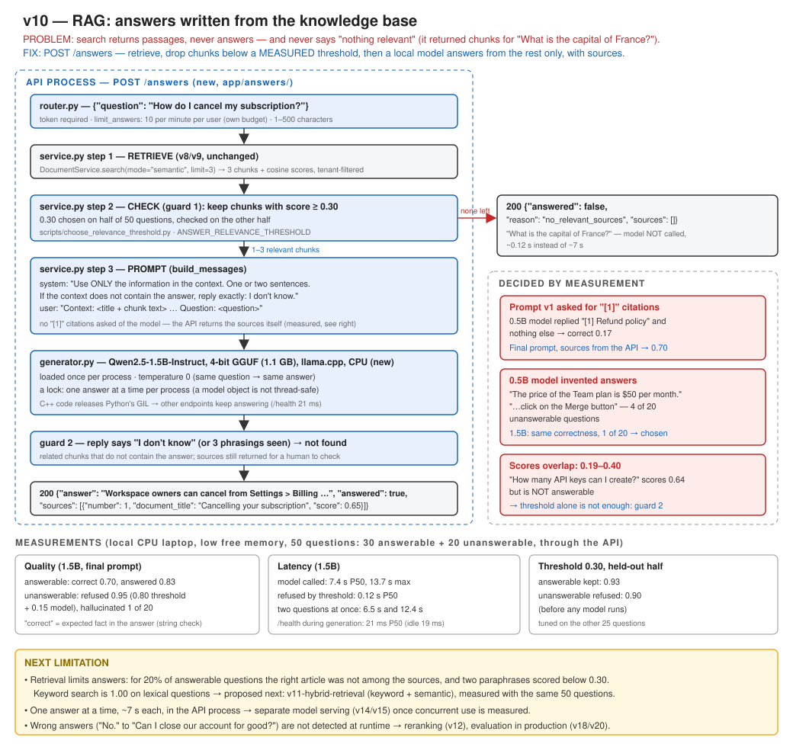

# v10 — RAG: answers written from the knowledge base

API 0.10.0 · generation model Qwen2.5-1.5B-Instruct (4-bit GGUF, llama.cpp, CPU) · embedding model unchanged · 218 tests passing (443 s, with the real answer model)



## Recap: where v9 left us

Priya asks *"Can I cancel our subscription?"*. v9 returns the right article in 150 ms: three
passages about cancelling, seats and billing. She still has to read them and write the answer
herself. Then she tries *"What is the capital of France?"* and gets three passages as well, the
closest ones, although none of them is about France.

What broke, in one sentence: search returns **passages, never answers**, and it **never says
"nothing relevant"** (v8 test: score < 0.3 for an unanswerable question, still returned).

What v9 changed: vectors moved into PostgreSQL (pgvector, HNSW). Semantic search at 50,000 chunks
went from 10.5 s to 147 ms (P50, API), with recall@5 0.99 on real text.

What was still wrong, and became v10: retrieval was fast and good, but the platform still could not
answer a question, or refuse one.

## Problem

Two problems, which must be solved together:

1. **No answer.** The user has to read and combine the chunks.
2. **No refusal.** Handing "closest but irrelevant" chunks to a language model invites a confident,
   invented answer. That is hallucination, the failure that makes an AI support tool dangerous.

The second problem has to be measured before the first is built. Otherwise there is no way to
tell whether the generator is answering or inventing.

## Current Architecture

```
GET /documents/search?q=…&mode=semantic → embed → pgvector HNSW → 5 chunks, always
```

## Why the Old Design Is Not Enough

Search leaves the judgement to a human. It shows five passages and scores, and the person decides.
Generation removes that human step, so the system itself needs two things it never had: a rule for
"relevant enough", and a way to produce text that stays inside the retrieved facts.

## Solution

**RAG (retrieval-augmented generation).** The model is not asked what *it* knows. A 1.5B model
knows little, and nothing about this company. It is given the few chunks that search found and told
to answer from those only.

```
POST /answers {"question": "How do I cancel my subscription?"}
  ▼ router.py            token, per-user answer budget (10/min), 1–500 characters
  ▼ service.py  1. RETRIEVE   DocumentService.search(mode="semantic", limit=3)   (v8/v9, unchanged)
                2. CHECK      keep chunks with score ≥ 0.30                     (guard 1)
                              none left → "not found"   ← model NOT called, ~0.12 s
                3. GENERATE   generator.py: Qwen2.5-1.5B via llama.cpp, temperature 0
                              system: "use ONLY the context … otherwise reply exactly: I don't know"
                              reply says "I don't know" → "not found"            (guard 2)
  200 {"answer": "Workspace owners can cancel from Settings > Billing > Cancel subscription …",
       "answered": true, "reason": "answered",
       "sources": [{"number": 1, "document_title": "Cancelling your subscription", "score": 0.65, …}]}
```

Files:

| File | What changed |
|---|---|
| `app/answers/generator.py` | **new**: loads the GGUF model once (`lru_cache`), `generate(messages, max_tokens)`, a lock so one answer runs at a time, `GenerationUnavailable` |
| `app/answers/service.py` | **new**: retrieve → threshold → prompt → generate → detect "I don't know" |
| `app/answers/router.py`, `schemas.py` | **new**: `POST /answers`; 422 / 503 / 429 like the rest of the API |
| `app/auth/dependencies.py`, `app/main.py` | `limit_answers`: its own per-user budget |
| `app/core/config.py` | `GENERATION_MODEL_PATH`, `ANSWER_RELEVANCE_THRESHOLD` (0.30), `ANSWER_MAX_SOURCES` (3), `ANSWER_MAX_TOKENS` (200), `ANSWER_RATE_LIMIT_PER_MINUTE` (10) |
| `evaluation/rag_questions.jsonl` | **new**: 50 questions, 30 answerable (with expected facts), 20 unanswerable, split tune/test |
| `scripts/choose_relevance_threshold.py` | **new**: best-score distributions and the threshold, chosen on one half and checked on the other |
| `scripts/evaluate_rag.py` | **new**: correctness, citation, refusal and hallucination rates, and latency, through the API |
| `scripts/download_generation_model.py` | **new**: fetches the model file (~1.1 GB) into `models/generation` |
| `tests/test_answers_api.py` | **new**: 9 tests |
| `requirements.in`, `requirements.txt` | `llama-cpp-python` (with the index of prebuilt CPU wheels) |

## Why This Solution?

**Why a threshold, and why 0.30?** ([ADR-028](../adr/ADR-028-relevance-threshold-before-generation.md))
It was measured on 50 questions, split in two halves: chosen on one, checked on the other. At 0.30
the test half kept 93% of answerable questions and refused 90% of unanswerable ones, before any
model ran. The two groups overlap (0.19–0.40, and one unanswerable question at 0.64), so a threshold
alone cannot be enough. That is why the model has its own "I don't know" instruction.

**Why this model?** ([ADR-027](../adr/ADR-027-local-rag-with-llama-cpp.md)) Both candidates were
equally correct (0.70) on answerable questions. On unanswerable ones the 0.5B model invented 4
answers out of 20 ("The price of the Team plan is $50 per month"), and the 1.5B model invented 1.
For a support tool, a made-up price is worse than one more second of waiting.

**Why llama.cpp in the API process?** One pip package, one model file, no new service. It releases
Python's GIL while it computes, so `/health` stayed at a P50 of 21 ms during generation. A separate
model service comes later, when there is a measured reason to scale it apart from the API.

**Why no citations written by the model?** The first prompt asked for "[1]"-style citations. The
0.5B model then often answered with **only** the citation ("[1] Refund policy"), and correct
answers were 0.17. Citations do not need the model: the API returns, as numbered sources, the exact
chunks the model was shown.

**Why `temperature=0`?** The same question gives the same answer. Evaluations are repeatable, and a
wrong answer can be reproduced and fixed.

### Failure-first: what happens when...

| Situation | What happens | Proved by |
|---|---|---|
| Nothing relevant is found | `answered: false`, `reason: no_relevant_sources`; the model is **not called** | `test_an_unrelated_question_is_not_found_and_the_model_is_not_called` |
| Chunks are related but lack the answer | The model says "I don't know" → `answered: false`, `reason: model_declined`, sources still returned | `test_when_the_model_does_not_know_the_answer_is_not_found` |
| Weakly related chunks are retrieved | Only chunks above the threshold reach the model | `test_only_chunks_above_the_threshold_reach_the_model` |
| Another organisation's documents | Never retrieved, so never in the prompt | `test_another_organisations_documents_never_reach_the_model` |
| The model file is missing or crashes | 503 "try GET /documents/search?mode=semantic"; search keeps working | `test_an_unavailable_model_is_503_and_search_still_works` |
| One user sends many questions | 429 after 10 a minute, with a budget separate from `/classify` | `test_answers_have_their_own_rate_limit` |
| Two questions arrive together | The second waits for the first (lock): 6.5 s and 12.4 s | measured, see below |
| The real model with the real prompt | Works end to end | `test_the_real_model_answers_from_the_sources` (skipped if the model is not downloaded) |

## New Trade-offs

- **Answers take seconds**: 7.4 s P50 through the API when the model runs, and 0.12 s when the
  threshold refuses.
- **One answer at a time per API process.** A second simultaneous question waits (12.4 s). Requests
  that do not generate are not slowed.
- **~1.1 GB more memory** in the API process, and 1.1 GB of disk for the model file.
- **Wrong answers still happen.** "Can I close our company account for good?" was answered "No.",
  which is wrong: deletion is possible. Nothing detects this at runtime. Only the evaluation shows
  it.
- **Answerable questions can be refused.** 2 of 30 fell below the threshold, and 3 more were declined
  by the model.
- **The evaluation is small and approximate.** 50 questions, and "correct" is a string check for
  an expected fact. It missed a right answer that did not repeat the number "600", and it cannot
  see a wrong sentence next to a right one.

## What Changed

- New endpoint `POST /answers`: retrieve, check relevance, generate, and return the answer with its
  sources, or "not found" with a reason.
- A measured relevance threshold, and a held-out check of it.
- A 50-question RAG evaluation with separate numbers for answerable and unanswerable questions.
- **Changed by measurement during the version:** citations are no longer written by the model
  (0.17 → 0.70 correct with the 0.5B model); 1.5B replaced 0.5B (hallucinations 4 → 1 of 20); three
  more phrasings of "I don't know" are recognised, because the model used them.

## How to Test

```bash
pip install -r requirements.txt
python scripts/download_generation_model.py
pytest -v
```

Run the API and the worker as before, then:

```bash
curl -X POST http://127.0.0.1:8000/answers -H "Authorization: Bearer $TOKEN" -H "Content-Type: application/json" -d "{\"question\": \"How do I cancel my subscription?\"}"
curl -X POST http://127.0.0.1:8000/answers -H "Authorization: Bearer $TOKEN" -H "Content-Type: application/json" -d "{\"question\": \"What is the capital of France?\"}"
```

Measure (`DB_ECHO=false`, with the evaluation knowledge base uploaded):

```bash
python scripts/choose_relevance_threshold.py --organization-id 6
python scripts/evaluate_rag.py --output evaluation/results/v10-rag.json
```

## Expected Result

- The first `curl` returns `"answered": true`, an answer mentioning Settings > Billing > Cancel
  subscription, and "Cancelling your subscription" as source 1, after several seconds (the first
  call also loads the model).
- The second returns `"answered": false`, `"reason": "no_relevant_sources"` and `"sources": []`,
  in a fraction of a second.

## Measurements

Local Windows 11 laptop, CPU only, one uvicorn process, `DB_ECHO=false`, with low free
memory (a few hundred MB). The D: drive was full, so the 1.5B model file was kept on another drive
for these runs. All numbers are from one session.

**1. Relevance threshold** (`scripts/choose_relevance_threshold.py`, best chunk score per question):

| Threshold | tune: answerable answered | tune: unanswerable refused | test: answered | test: refused |
|---|---|---|---|---|
| 0.25 | 0.93 | 0.50 | 1.00 | 0.70 |
| **0.30** | **0.93** | **0.70** | **0.93** | **0.90** |
| 0.35 | 0.73 | 0.90 | 0.93 | 0.90 |
| 0.40 | 0.67 | 0.90 | 0.67 | 1.00 |

Answerable questions scored 0.19–0.72, and unanswerable ones 0.04–0.64. The two lowest answerable
scores were "I want you to forget everything you know about me" (0.19) and "When can I talk to a
human?" (0.25). The highest unanswerable score was "How many API keys can I create?" (0.64).

**2. Answers, end to end** (`scripts/evaluate_rag.py`, through the API, 50 questions):

| | 0.5B, first prompt (with "[1]") | 0.5B, final prompt | **1.5B, final prompt** |
|---|---|---|---|
| Answerable: answered | 0.80 | 0.90 | 0.83 |
| Answerable: **correct** (contains the expected fact) | **0.17** | 0.70 | **0.70** |
| Answerable: right article among sources | 0.80 | 0.80 | 0.80 |
| Unanswerable: **refused** | 0.95 | 0.80 | **0.95** |
| — by the threshold / by the model | 0.80 / 0.15 | 0.80 / 0.00 | 0.80 / 0.15 |
| Unanswerable: **hallucinated** | 0.05 | **0.20** | **0.05** |
| Time when the model runs, P50 / max | 5.4 / 9.5 s | 6.3 / 11.9 s | 7.4 / 13.7 s |
| Time when refused by the threshold, P50 | 0.14 s | 0.16 s | 0.12 s |

The first prompt's high refusal rate is not a success: that model barely answered anything. The
final 1.5B run is in `evaluation/results/v10-rag.json`, with every question, answer and source.

Its one hallucination: *"How many API keys can I create?"* → "You can create 600 API keys per
minute per API key". The number comes from the rate-limit article, attached to the wrong fact. Its
clearly wrong answers: "No." to both "Can a colleague get access to our account?" and "Can I close
our company account for good?".

**3. Serving** (1.5B, API):

| | Measured |
|---|---|
| One answer alone | 6.7 s |
| Two different questions sent at once | 6.5 s and **12.4 s** (they take turns) |
| `/health` P50, idle / during two answers | 18.8 ms / 21.1 ms (max 105 ms, n=97) |
| Model load in-process (0.5B, first smoke test) | 3.7 s |
| First answer of the 0.5B smoke test / second | 16.0 s / 3.0 s (warm-up) |

## Interview Explanation

"Search found the right article, but a person still had to read it. Worse, semantic search always
returns something, so a naive RAG would hand irrelevant text to the model and get a confident, made
up answer. So I measured refusal before I built generation. I wrote 50 questions, 30 answerable and
20 not, and looked at the retrieval scores. I picked a threshold of 0.30 on half of them and checked
it on the other half: it refused 90% of unanswerable questions without calling the model. The score
ranges overlap, so the model also has an 'I don't know' instruction as a second guard. Generation
runs locally with llama.cpp and a 1.5B model. I compared it with a 0.5B model: both were right 70%
of the time, but the small one invented a price and a 'Merge' button, so I took the bigger one.
Measuring also changed the prompt. Asking the model for citation markers made the small one output
only the marker, so the API returns the sources itself. The limits are measured too: about 7 seconds
per answer on a CPU, one answer at a time, and a few wrong answers that only the evaluation catches."

## Next Possible Limitation

- **Retrieval limits answers.** For 20% of answerable questions the right article was not among the
  sources, and two were refused because their best score was below 0.30. Keyword search is 1.00 on
  the lexical questions and fast. **Proposed next: v11-hybrid-retrieval**, combining keyword and
  semantic scores, measured with `scripts/evaluate_rag.py` and the retrieval evaluation.
- **One answer at a time, ~7 s each.** Real concurrent use would queue answers. That is the trigger
  for a separate model service (v14/v15), once there is more than one user to measure.
- **Wrong answers are not detected at runtime.** A reranker (v12) or an answer-checking step, and
  later evaluation in production (v18/v20).
