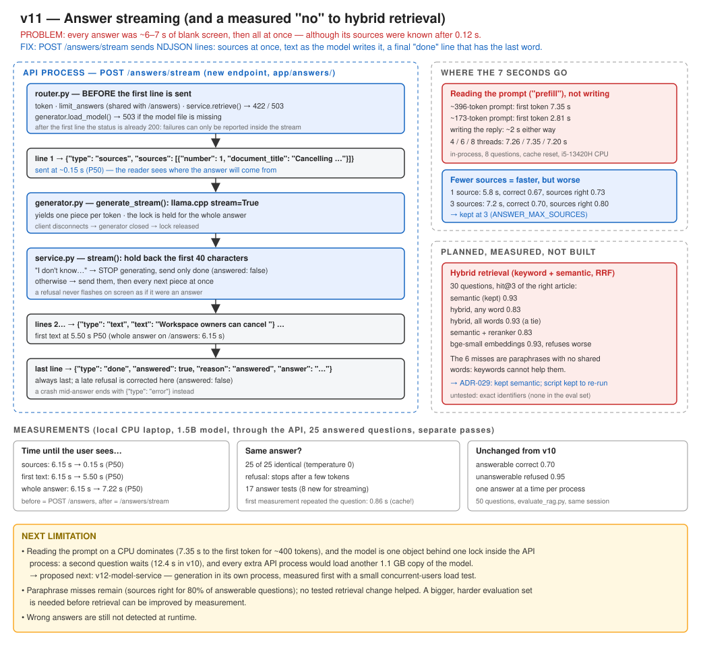

# v11 — Answer streaming (and a measured "no" to hybrid retrieval)

API 0.11.0 · generation model Qwen2.5-1.5B-Instruct (unchanged) · embedding model unchanged · 226 tests passing (522 s, with the real answer model)



## Recap: where v10 left us

Priya asks *"How do I cancel my subscription?"* and gets a correct answer with its source: "Workspace
owners can cancel from Settings > Billing > Cancel subscription". It arrives after **~7 seconds of
a blank screen**. A second question from her colleague Tom, sent at the same moment, takes
**12.4 s**, because the model answers one question at a time.

What broke, in one sentence: every answer took 7.4 s P50 to appear, all at once at the end, although
its sources were known after 0.12 s.

What v10 changed: `POST /answers` retrieves 3 chunks, refuses below a measured threshold (0.30), and
lets a local 1.5B model answer from the rest. 95% of unanswerable questions were refused, and 70% of
answerable ones were answered correctly.

What was still wrong: the planned next step was hybrid retrieval, meant to fix the 20% of answerable
questions whose sources missed the right article. It was measured first, and it did not help (see
below). The wait was the remaining measured problem.

## Problem

1. **The planned fix did not work.** Hybrid retrieval (keyword + semantic, merged by reciprocal
   rank fusion) lowered hit@3 from 0.93 to 0.83 on the same 30 questions. The best variant only tied
   plain semantic search. A reranker was also worse (0.83), and a stronger embedding model refused
   unanswerable questions worse. The 6 misses are paraphrases that share no words with their
   article, so keyword search cannot help them
   ([ADR-029](../adr/ADR-029-no-hybrid-retrieval-yet.md)).
2. **The wait.** 6–7 s of nothing, then the whole answer at once.

## Current Architecture

```
POST /answers → retrieve (0.12 s) → threshold → model (≈6–7 s) → one JSON response
```

## Why the Old Design Is Not Enough

The response cannot start until the model has written its last word. The sources, the most
reliable part, known in 0.12 s, wait with it. A person cannot tell "working" from "stuck".

## Solution

`POST /answers/stream`: the same answer, sent as it is produced, as **NDJSON** (one JSON object per
line, each line sent as soon as it exists).

```
POST /answers/stream {"question": "How do I cancel my subscription?"}
  ▼ router.py  BEFORE the first line (so failures keep their status codes):
               token, rate limit, service.retrieve() → 422 / 503, generator.load_model() → 503
  ▼ line 1     {"type": "sources", "sources": [{"number": 1, "document_title": "Cancelling …"}]}   ~0.15 s
  ▼ service.stream()   generator.generate_stream(): llama.cpp stream=True, one piece per token
               the first 40 characters are held back: "I don't know…"? → stop generating
  ▼ lines 2…   {"type": "text", "text": "Workspace owners can cancel "} …                  first at ~5.5 s
  ▼ last line  {"type": "done", "answered": true, "reason": "answered", "answer": "<the full text>"}
               (a crash mid-answer ends with {"type": "error", …} instead)
```

Files:

| File | What changed |
|---|---|
| `app/answers/generator.py` | `generate_stream()` yields pieces (lock held for the whole answer); `load_model()` fails early with `GenerationUnavailable` |
| `app/answers/service.py` | `retrieve()` split out (used by both endpoints); `model_declined()`; `stream()` holds back 40 characters, stops on a refusal, and ends with `done` |
| `app/answers/router.py` | `POST /answers/stream` (NDJSON); one `to_http_error()` for both endpoints |
| `app/core/config.py` | version 0.11.0; `ANSWER_MAX_SOURCES` comment now carries the measured trade-off |
| `tests/test_answers_api.py` | 8 new tests (17 in total) |
| `scripts/measure_answer_streaming.py` | **new**: whole vs streamed: sources, first text, done |
| `scripts/compare_hybrid_retrieval.py` | **new**: semantic vs hybrid (RRF) on the retrieval questions |

## Why This Solution?

**Why streaming rather than a faster model?** On this CPU both models tested in v10 answer in
seconds. Streaming changes what the person sees without changing what the model computes. The
answer is identical (25 of 25 questions, temperature 0).

**Why NDJSON?** ([ADR-030](../adr/ADR-030-stream-answers-as-ndjson.md)) It is the simplest
streaming format: one ordinary JSON object per line, readable by any HTTP client. SSE's browser
client only sends GET, and WebSockets add a two-way protocol that nothing here needs.

**Why hold back 40 characters?** A refusal ("I don't know.") is the start of the reply. Streamed
blindly, it would flash on screen as an answer before the final line corrected it. Holding back
~10 tokens costs a fraction of a second, and it lets generation **stop** on a refusal, where the
non-streamed endpoint pays for the whole reply.

**Why not hybrid retrieval, as planned?** Because it was measured and lost. See the table under
Measurements and ADR-029. Code that makes results worse is not shipped. The comparison script is
kept, so it can be re-run when the knowledge base changes.

**Why keep 3 sources, when 1 is faster?** It was measured through `evaluate_rag.py`. 1 source cut
the P50 from 7.2 s to 5.8 s, but the right article was among the sources less often (0.80 → 0.73)
and correctness fell (0.70 → 0.67). Refusals were unchanged (0.95). A slower right answer is better
than a faster wrong one.

### Failure-first: what happens when...

| Situation | What happens | Proved by |
|---|---|---|
| Nothing relevant | One line: `done`, `answered: false`, `no_relevant_sources`; the model is not called | `test_a_stream_for_an_unrelated_question_is_one_done_line` |
| The model refuses at the start | No text line at all; `done` with `model_declined`; generation stops after a few pieces | `test_a_refusal_is_never_streamed_as_text_and_generation_stops` |
| The model refuses late in the reply | Text was shown; the `done` line says `answered: false` | `test_a_late_refusal_is_corrected_by_the_done_line` |
| The model file is missing | A normal 503 JSON error **before** the stream starts | `test_a_missing_model_is_a_503_before_the_stream_starts` |
| The model crashes mid-answer | The stream ends with an `error` line (the 200 was already sent) | `test_a_crash_during_the_stream_ends_with_an_error_line` |
| Many streamed questions | The same per-user answer budget as `/answers` (10/min) | `test_streaming_shares_the_answer_rate_limit` |
| The client disconnects | The generator is closed and the lock released (Python closes it) | by design; not tested |

## New Trade-offs

- **Only the sources arrive much sooner.** The first text is at 5.5 s, against 6.15 s for the whole
  answer, because the model spends most of its time **reading the prompt** (prefill). A ~400-token
  prompt took 7.35 s to the first token in-process, and a ~170-token prompt 2.81 s.
- **Streaming takes a little longer in total** (done at 7.22 s vs 6.15 s P50): the held-back
  characters, and one thread-pool hop per piece.
- **The client carries more logic.** It must read lines, and trust `done` over any text it
  already showed.
- **The lock is held while sending.** A slow reader delays the next person's answer.
- **Hybrid retrieval's strength is unmeasured, not absent.** The evaluation has no exact
  identifiers (error codes, invoice numbers), which is where keyword search should win.

## What Changed

- New `POST /answers/stream`. `POST /answers` behaves as before.
- Retrieval, prompt and refusal check shared by both endpoints.
- Hybrid retrieval, a reranker and a second embedding model were measured and **not** adopted.
- The number of sources was measured as a latency knob and kept at 3.
- **Caught by measuring:** the first streaming measurement asked each question twice in a row and
  showed the text starting at 0.86 s. llama.cpp was reusing the work for a prompt it had just read.
  With separate passes the real figure is 5.50 s (standing rule 19 again).

## How to Test

```bash
pytest tests/test_answers_api.py -v
```

With the API running and the model downloaded:

```bash
curl -N -X POST http://127.0.0.1:8000/answers/stream -H "Authorization: Bearer $TOKEN" -H "Content-Type: application/json" -d "{\"question\": \"How do I cancel my subscription?\"}"
```

(`-N` tells curl not to buffer, so each line appears when it arrives.)

Measure (`DB_ECHO=false`):

```bash
python scripts/measure_answer_streaming.py
python scripts/compare_hybrid_retrieval.py --organization-id 6
```

## Expected Result

- `curl` prints the `sources` line almost at once, then `text` lines a few seconds later, then
  `done`.
- For "What is the capital of France?" it prints a single `done` line with `"answered": false`.

## Measurements

Local Windows 11 laptop, CPU only (i5-13420H, 8 cores), one uvicorn process, 1.5B model, low free
memory. During the session Docker Desktop stopped and had to be restarted, and one API process died
mid-run. Both runs were repeated, and only complete runs are reported.

**1. Streaming** (`scripts/measure_answer_streaming.py`, 25 answered questions, all 30 asked with
`/answers` first, then all 30 streamed):

| | P50 |
|---|---|
| `POST /answers`, whole answer | 6.15 s |
| `/answers/stream`, sources line | **0.15 s** |
| `/answers/stream`, first text | 5.50 s (max 9.13 s) |
| `/answers/stream`, done | 7.22 s |
| Same answer text | 25 of 25 |

**2. Where the time goes** (in-process, 8 questions, KV cache reset between questions):

| Prompt | First token P50 | Whole reply P50 |
|---|---|---|
| 3 sources, ~396 tokens | 7.35 s | 9.11 s |
| 1 source, ~173 tokens | 2.81 s | 4.64 s |
| 3 sources, 4 / 8 threads (6 is the default) | 7.26 / 7.20 s | 9.20 / 9.15 s |

**3. Number of sources** (`scripts/evaluate_rag.py`, 50 questions, same session):

| `ANSWER_MAX_SOURCES` | correct | right article in sources | refused (unanswerable) | P50 when the model runs |
|---|---|---|---|---|
| **3 (kept)** | **0.70** | **0.80** | 0.95 | 7.2 s |
| 1 | 0.67 | 0.73 | 0.95 | 5.8 s |

**4. Hybrid retrieval and alternatives** (the 30 retrieval questions; details in ADR-029):

| Method | hit@1 / hit@3 / MRR (20-chunk KB) | same + 12,000 unrelated paragraphs |
|---|---|---|
| **semantic (kept)** | **0.80 / 0.93 / 0.87** | 0.67 / 0.83 / 0.77 |
| hybrid RRF, any word | 0.73 / 0.83 / 0.82 | 0.53 / 0.83 / 0.70 |
| hybrid RRF, all words | 0.80 / 0.93 / 0.87 | 0.70 / 0.83 / 0.79 |
| semantic + ms-marco reranker | 0.77 / 0.83 / 0.83 | not run |
| bge-small embeddings | 0.87 / 0.93 / 0.90 (refusal on held-out half: 0.80 vs 0.90) | not run |

## Interview Explanation

"My plan said the next step was hybrid retrieval. Before building it I tested it on the evaluation
set, and it made retrieval worse: hit@3 fell from 0.93 to 0.83, because common keywords pulled wrong
articles up for paraphrased questions. A reranker and a bigger embedding model didn't help either.
So I didn't ship it. I recorded the result and kept the comparison script. The measured problem was
the wait: about 7 seconds of blank screen per answer. I added a streaming endpoint that sends the
sources in 150 ms and then the text as the model writes it, as newline-delimited JSON. Two details
mattered: every error that has a status code is checked before the first byte, and I hold back the
first 40 characters so an 'I don't know' is never shown as an answer. The measurement also showed
the limit of streaming. The first word still took 5.5 seconds, because on a CPU the model spends
most of its time reading the prompt, not writing. A 170-token prompt starts in 2.8 s, a 400-token
one in 7.3 s. That points at hardware or a separate model service, not at more streaming."

## Next Possible Limitation

- **Prefill on a CPU dominates** (7.35 s to the first token for a ~400-token prompt), and there is
  **one model, one lock per API process**: the second of two questions waits (12.4 s in v10).
  Every extra API process would load another 1.1 GB copy of the model. **Proposed next:
  v12-model-service**, which moves generation into its own process that the API calls, measured
  first with a small concurrent-users load test.
- **Retrieval misses on paraphrases** remain (sources right for 80% of answerable questions). None
  of the tested fixes helped on this evaluation. A larger, harder evaluation set is needed before
  retrieval can be improved by measurement.
- **Wrong answers are still not detected at runtime.**
