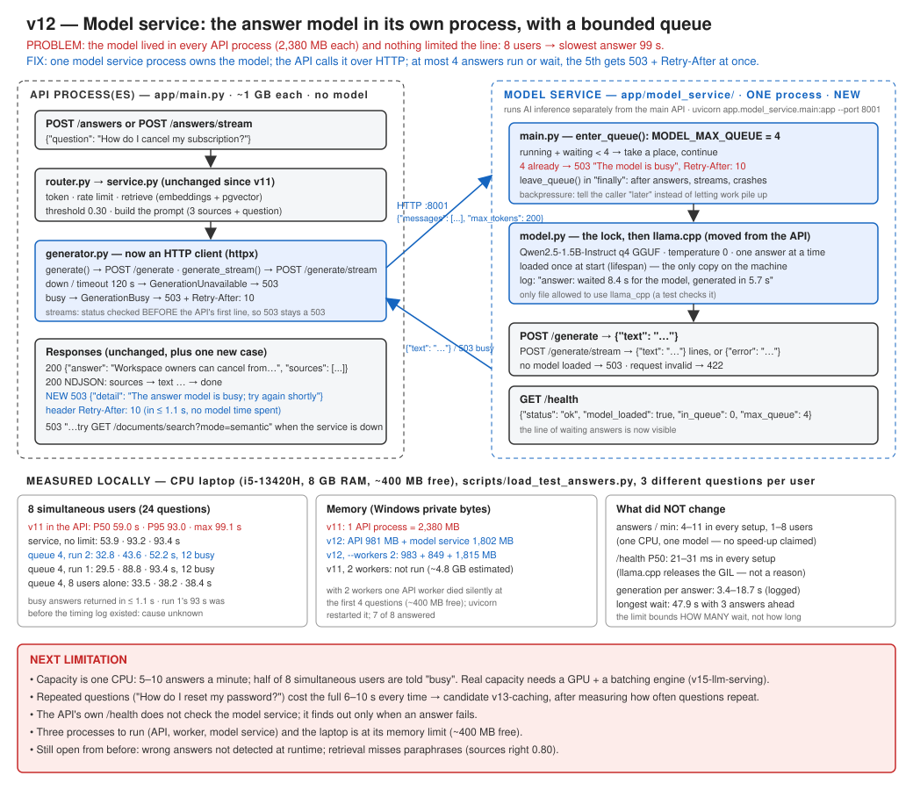

# v12 — Model service: the answer model in its own process, with a bounded queue

API 0.12.0 · generation model Qwen2.5-1.5B-Instruct (unchanged) · embedding model unchanged · 238 tests passing (529 s, with the real answer model)



## Recap: where v11 left us

Priya asks *"How do I cancel my subscription?"* and sees the sources after 0.15 s and the answer
starting at ~5.5 s. That is fine for one person. On a Monday morning eight support agents ask at
once. The model writes one answer at a time, so the eighth agent waits for seven answers first.

What broke, in one sentence: with 8 simultaneous users, answers took **59 s P50 and 99 s at worst**,
and the only way to add HTTP capacity, a second API process, would load a second copy of the
model into a process that already used **2.4 GB** on an 8 GB laptop.

What v11 changed: `POST /answers/stream` sends the sources at once and the text as it is written.
It also showed that on a CPU most of an answer is spent **reading the prompt** (7.35 s of 9.11 s).

What was still wrong: the model lived inside every API process, behind a lock that only that
process knew about. Nothing limited how many answers could pile up behind it.

## Problem

Measured first, as planned (`scripts/load_test_answers.py`, 1/2/4/8 users, each asking 3 different
questions one after another, the v11 code with the model inside the API):

| Users | Answered | P50 | P95 | Max | Answers / min | `/health` P50 |
|---|---|---|---|---|---|---|
| 1 | 3 | 11.0 s | 20.0 s | 20.0 s | 3.7 | 27 ms |
| 2 | 6 | 10.7 s | 12.6 s | 12.6 s | 10.6 | 21 ms |
| 4 | 12 | 23.8 s | 27.9 s | 29.6 s | 9.5 | 21 ms |
| 8 | 24 | **59.0 s** | **93.0 s** | **99.1 s** | 7.3 | 25 ms |

Three findings:

1. **Capacity is fixed.** 4–11 answers a minute whatever the number of users. One CPU runs one
   model. More users only means a longer line.
2. **The line has no end.** Every request waits its turn, however long the line is. At 8 users the
   slowest answer took 99 s. Nobody waits 99 s for a support answer: they leave, and the model
   still spends the CPU on it.
3. **The rest of the API was fine.** `/health` stayed at ~25 ms P50, because llama.cpp releases
   Python's GIL while it computes. Separating the model was **not** needed to keep the API
   responsive, and this version does not claim that.

And the memory: the API process with the model loaded used **2,380 MB** private memory. Free RAM
was 440 MB. A second API process (`--workers 2`) would need another 2.4 GB that did not exist,
and each would keep its own lock and its own line, knowing nothing about the other.

## Current Architecture

```
API process (×1): HTTP + embeddings + llama.cpp model (1.1 GB file, 2.4 GB process) + one lock
```

## Why the Old Design Is Not Enough

- **Scaling the API scales the model.** Every API process would load the model. HTTP work
  (tokens, search, JSON) is cheap; the model is expensive. They could not be sized separately.
- **No backpressure.** Nothing said "too busy, try later". The queue was invisible: the waiting
  requests were threads blocked on a lock.
- **No visibility.** There was no way to tell "waited 40 s for the model" from "the model took
  40 s", which need opposite fixes.

## Solution

Move the model into a **model service**: a second, small FastAPI app whose only job is running the
model. The API calls it over HTTP.

```
POST /answers {"question": "How do I cancel my subscription?"}
  ▼ API (app/main.py, any number of processes, ~1 GB each, no model)
    router.py → service.py: retrieve (embeddings + pgvector), threshold, build the prompt
  ▼ generator.py: HTTP POST http://127.0.0.1:8001/generate {"messages": [...], "max_tokens": 200}
  ▼ model service (app/model_service/main.py, ONE process, the only copy of the model)
      enter_queue(): 4 places (running + waiting). Full → 503 + Retry-After: 10, in ~1 s
      model.py: wait for the lock → llama.cpp writes the answer → log "waited X s, generated in Y s"
  ◀ {"text": "Workspace owners can cancel from Settings > Billing > ..."}
  ◀ API: the same AnswerResponse as v10 (or 503 "busy; try again shortly" + Retry-After)
```

Streaming works the same way: `POST /generate/stream` answers with NDJSON lines `{"text": "..."}`,
and the API turns them into its own `text` events. The API opens the connection and checks the
status **before** it sends its own first line, so "busy" and "down" are still normal 503s.

Files:

| File | What changed |
|---|---|
| `app/model_service/main.py` | **new**: the model service. `GET /health`, `POST /generate`, `POST /generate/stream`; the queue limit (`enter_queue` / `leave_queue`); loads the model at start |
| `app/model_service/model.py` | **new**: the llama.cpp code moved out of the API: `load()`, `generate()`, `generate_stream()`, the lock, and one timing log line per answer |
| `app/answers/generator.py` | now an HTTP client (httpx) for the model service; `GenerationBusy` (503 + Retry-After); `load_model()` removed |
| `app/answers/service.py` | `stream()` became `open_stream()`, which connects to the model **before** returning the events |
| `app/answers/router.py` | busy → 503 with `Retry-After`; streaming uses `open_stream()` |
| `app/core/config.py` | version 0.12.0; `MODEL_SERVICE_URL`, `MODEL_SERVICE_TIMEOUT_SECONDS`, `MODEL_MAX_QUEUE` (4), `MODEL_BUSY_RETRY_AFTER_SECONDS` (10) |
| `tests/test_model_service.py` | **new**: 8 tests |
| `tests/test_answers_api.py` | 4 new tests (API ↔ model service); real-model tests now go through the model service |
| `scripts/load_test_answers.py` | **new**: concurrent users, P50/P95/max, answers/min, `/health` during the run |

## Why This Solution?

**Why a separate process at all?** ([ADR-031](../adr/ADR-031-separate-model-service.md)) Because
the model and the HTTP API need different amounts of the machine. The API is cheap per request and
should scale with traffic. The model is 1.1 GB and uses every core for one answer; one copy per
machine is the right number on a CPU. Two copies would each run at half speed.

**Why our own small FastAPI app, and not llama.cpp's server or vLLM?** The project already uses
FastAPI, the service is ~250 lines with comments, that a reader can follow, and it keeps our exact prompt handling and
queue rule. llama.cpp's own server (`llama-server`) can run several answers in one batch, but on a
CPU where reading the prompt dominates, batching does not create cores. It is the right move once
there is a GPU (planned `v15-llm-serving`). vLLM needs a GPU.

**Why HTTP, and not the PostgreSQL queue from v7?** An answer is a request someone is waiting for,
in seconds, and it streams. A database queue adds polling delay and has no natural way to stream
pieces back. HTTP is request/response, which is what this is.

**Why a queue limit of 4?** ([ADR-032](../adr/ADR-032-bounded-model-queue.md)) At ~6–10 s an
answer, the 4th in line waits for 3 answers: ~25–30 s. Beyond that, "try again in 10 s" is more
honest than a minute of silence. A refused request costs ~1 s and no model time.

**Why keep the lock inside the service?** Because the measurement says one answer at a time is the
real capacity of this CPU. The service does not pretend otherwise; it makes the line **visible**
(`/health` shows `in_queue`) and **bounded**.

### Failure-first: what happens when...

| Situation | What happens | Proved by |
|---|---|---|
| The model service is not running | `/answers` and `/answers/stream` return 503 "try GET /documents/search?mode=semantic"; search still works | `test_a_model_service_that_is_down_is_a_503` |
| The queue is full | 503 in ~1 s with `Retry-After: 10`, the model is never called | `test_a_full_queue_is_refused_at_once_with_retry_after`, `test_a_busy_model_service_is_a_503_with_retry_after` |
| The model file is missing | The service starts anyway; its `/health` says `degraded`; generation is 503 | `test_without_a_model_both_endpoints_are_503_and_health_says_so` |
| The model crashes mid-stream | The service sends `{"error": ...}`; the API ends its stream with an `error` line | `test_a_crash_mid_stream_ends_with_an_error_line`, `test_a_model_service_that_stops_mid_answer_ends_the_stream_with_an_error` |
| A queue place is never given back | Capacity would shrink until a restart. Places are freed after answers, streams and crashes | `test_every_queue_place_is_given_back` |
| The model service hangs | The API gives up after 120 s (`MODEL_SERVICE_TIMEOUT_SECONDS`) → 503 | by design; not tested |
| Someone adds llama.cpp back to the API | A test fails: only `app/model_service/model.py` may use it | `test_only_the_model_service_uses_llama_cpp` |

## New Trade-offs

- **One more process to run, watch and restart.** Three now: API, worker, model service. The API
  does not check the model service in its own `/health` yet.
- **It is not faster.** Throughput stayed at 5–10 answers a minute, because the machine did not
  change. The separation pays off in memory and control, not speed.
- **Some users are refused.** With 8 users, half the requests got "busy". That is the design: a
  quick "try again" instead of a 99-s wait. The client (or the person) has to retry.
- **The limit bounds how many wait, not how long.** When the laptop slowed and answers took
  15–18 s, a request waited 48 s with 3 answers ahead of it.
- **Total memory went up slightly** for one API process (981 + 1,802 MB vs 2,380 MB), because
  there are now two Python processes. It goes down from the second API process on.
- **A network hop.** Milliseconds next to seconds of generation; it also means a timeout to choose.

## What Changed

- The answer model runs only in the model service. The API holds no copy of it.
- At most 4 answers run or wait; one more is refused at once with `Retry-After`.
- Every answer logs how long it waited and how long it generated.
- The public API is unchanged, except a new 503 "busy" case with `Retry-After`.

## How to Test

```bash
pytest tests/test_model_service.py tests/test_answers_api.py -v
```

Run the three processes (three terminals), with `DB_ECHO=false`:

```bash
uvicorn app.model_service.main:app --port 8001
uvicorn app.main:app --port 8000
python -m app.worker
```

```bash
curl http://127.0.0.1:8001/health
```

Load test (the per-user rate limit must be off, or one test user is refused after 10 answers a
minute):

```bash
RATE_LIMIT_ENABLED=false uvicorn app.main:app --port 8000
python scripts/load_test_answers.py
```

PowerShell: `$env:RATE_LIMIT_ENABLED="false"; uvicorn app.main:app --port 8000`.

## Expected Result

- The model service's `/health` prints `{"status": "ok", "model_loaded": true, "in_queue": 0, "max_queue": 4}`.
- Its log prints one line per answer, e.g. `answer: waited 8.4 s for the model, generated in 5.7 s`.
- With the model service stopped, `POST /answers` returns 503 and `/documents/search` still works.
- The load test prints a table like the ones below. At 8 users, about half the requests are `busy`.

## Measurements

Local Windows 11 laptop, CPU only (i5-13420H, 8 cores, 8 GB RAM, **~400 MB free** during the runs,
which is the main source of noise). Same session, same machine (standing rule 1). The model service
without a limit was run only to separate the two effects (moving the model vs limiting the queue).
The session was interrupted twice (the machine restarted once, and Docker Desktop had to be
started again); runs that overlapped with a leftover load test were thrown away.

**1. Concurrent users** (`scripts/load_test_answers.py`, 3 different questions per user, P50 / P95 /
max in seconds; answers per minute):

| Users | v11: model inside the API | Model service, no limit | Model service, queue 4 (run 1) | Model service, queue 4 (run 2) |
|---|---|---|---|---|
| 1 | 11.0 / 20.0 / 20.0 · 3.7 | 9.1 / 16.6 / 16.6 · 5.2 | 7.8 / 11.1 / 11.1 · 6.3 | 8.8 / 10.8 / 10.8 · 6.0 |
| 2 | 10.7 / 12.6 / 12.6 · 10.6 | 17.8 / 24.2 / 24.2 · 6.3 | 12.2 / 15.0 / 15.0 · 9.0 | 14.4 / 16.2 / 16.2 · 8.3 |
| 4 | 23.8 / 27.9 / 29.6 · 9.5 | 35.4 / 38.1 / 44.5 · 5.8 | 31.3 / 36.4 / 37.1 · 7.6 | 42.1 / 60.4 / 61.0 · 5.2 |
| 8 | 59.0 / 93.0 / 99.1 · 7.3 | 53.9 / 93.2 / 93.4 · 6.5 | 29.5 / 88.8 / 93.4 · 4.8 | **32.8 / 43.6 / 52.2** · 6.6 |
| 8: refused as busy | 0 of 24 | 0 of 24 | 12 of 24 (in ≤ 1.1 s) | 12 of 24 (in ≤ 1.1 s) |

A third 8-user run alone: 13 answered, 11 busy, 33.5 / 38.2 / 38.4 s.

How to read it:

- **Answers per minute did not improve** (3.7–10.6 in every setup). The differences between
  columns are within this laptop's run-to-run noise: the same setup gave 7.6 and 5.2 at 4 users.
- **The queue limit is what shortens the worst case at 8 users:** in 2 of 3 runs the slowest answer
  was 38–52 s instead of 93–99 s, and the other half were told "busy" within a second.
- **Run 1 at 8 users still had a 93 s maximum.** It ran before the timing log existed, so its cause
  is not known. The logged run 2 showed why a bounded queue can still wait long: 3 answers ahead
  that each took 12–17 s.
- **`/health` stayed at 21–31 ms P50** in every setup (P95 up to 215 ms).

**2. Where the waiting goes** (model service log, run 2, 32 answers): generation took **3.4–18.7 s**
per answer; the wait for the model was 0 s when alone and at most **47.9 s** with 3 answers ahead
(45.1 s ≈ the 12.3 + 16.8 + 16.2 s of the three answers before it).

**3. Memory** (Windows private bytes, after the load tests):

| Setup | API process(es) | Model service | Total |
|---|---|---|---|
| v11, 1 API process | 2,380 MB | — | 2,380 MB |
| v12, 1 API process | 981 MB | 1,802 MB | 2,783 MB |
| v12, 2 API processes (`--workers 2`) | 983 + 849 MB | 1,815 MB | 3,647 MB |
| v11, 2 API processes | not run: ~4,760 MB estimated (2 × 2,380), more than the free RAM | | |

With `--workers 2`, one API worker **died silently** during the first four simultaneous questions
(free RAM ~400 MB; no traceback). uvicorn started a new one, and 7 of 8 questions were answered.
The cause was not proved.

## Interview Explanation

"Before building a model service I load-tested the existing design with 1 to 8 concurrent users.
Throughput was flat, about 4 to 10 answers a minute, because one CPU runs one model, and with 8
users the slowest answer took 99 seconds. The API itself stayed responsive, since llama.cpp releases
the GIL, so I did not claim that as a reason. The real problems were that every API process loaded
its own 2.4-gigabyte copy of the model, and that nothing bounded the line of waiting requests. I
moved the model into a small FastAPI service, one process, that the API calls over HTTP. It allows 4
answers to run or wait and refuses the fifth in about a second with a 503 and Retry-After. That's
backpressure. It made nothing faster, and I say so: the gain is that API processes dropped to about
1 GB, all of them share one model and one queue, and the worst case at 8 users went from 99 seconds
to 38 to 52 in two of three runs, with the rest told to retry. I also log wait time and generation
time separately, which showed that a bounded queue still waits long when each answer is slow."

## Next Possible Limitation

- **Capacity is one CPU.** 5–10 answers a minute, and half of 8 simultaneous users are turned away.
  The next real step is hardware (a GPU) with a serving engine that batches, planned as
  `v15-llm-serving`. On this CPU, prefill dominates and batching cannot create cores.
- **Repeated questions are recomputed.** Many support questions repeat ("How do I reset my
  password?"). Each costs the full ~6–10 s. A cache of answers per organisation, invalidated when its
  documents change, could return them in milliseconds (planned `v13-caching`). It needs a
  measurement first: how often do questions actually repeat?
- **The API does not know if the model service is up** until an answer fails; its `/health` does not
  check it.
- **The laptop is at its memory limit** (~400 MB free): a second API worker died once.
