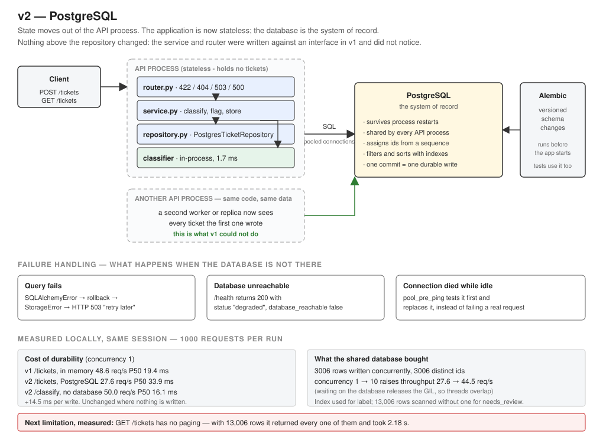

# Version v2 — PostgreSQL

Branch: `v2-postgresql`
API version: `0.2.0` · Model version: `v0.1.0` (unchanged)
Status: complete

## Problem

Three requirements the in-memory store could not meet:

1. **Durability.** Restarting the server lost every ticket.
2. **Shared state.** Measured in v1: `POST /tickets` on port 8000 returned `id 1`, while
   `GET /tickets` on port 8001 returned `total 0`. Two processes, two realities.
3. **Real queries.** `list()` loaded every ticket into a Python list and filtered it there.

## Current Architecture

v1: one FastAPI process organised by feature, with `InMemoryTicketRepository` — a dictionary
guarded by a lock — holding tickets inside the process. Measured ~48.6 req/s on `/tickets`.

## Why the Old Design Is Not Enough

Beyond losing data, the design had a structural consequence: **the cheapest fix for the
throughput ceiling was unavailable.** Inference is CPU-bound and Python's GIL stops threads
from helping, so the standard remedy is more processes (`uvicorn --workers N`). That could not
be done, because each worker would own a separate store and produce duplicate ids and reads
that miss recent writes.

So the trigger was not "an application should have a database". It was: a measured performance
fix was blocked by the storage design.

## Solution

PostgreSQL as the system of record, placed **behind the repository interface built in v1**.



```
Client → FastAPI → TicketService → PostgresTicketRepository → PostgreSQL
                         ↓
                   Classifier (unchanged, in-process)
```

What was added:

| Component | Purpose |
|---|---|
| PostgreSQL 17 (Docker Compose) | Durable, shared storage with real queries |
| SQLAlchemy 2.0 (typed style) | Maps `Ticket` objects to the `tickets` table |
| psycopg 3 | The PostgreSQL driver |
| Alembic | Versioned schema changes; also builds the test database |
| `StorageError` | One error type the upper layers own, so they never import SQLAlchemy |
| `database_reachable` on `/health` | Reports storage availability instead of hiding it |

`TicketService` and `app/tickets/router.py` kept their logic. The service's only change was a
type hint: `InMemoryTicketRepository` → `TicketRepository`.

## Why This Solution?

**PostgreSQL rather than something smaller.** Options considered:

| Option | Assessment |
|---|---|
| JSON file on disk | Durable, but every write rewrites the file, no concurrent access, no queries |
| SQLite | Genuinely tempting: real SQL, durable, no server, and with WAL it even handles multiple processes on one machine. It does not give multiple machines, high write concurrency, or the operational shape this roadmap heads toward. For a single-user desktop application it would be the right answer |
| **PostgreSQL** | **Chosen.** Free, runs locally in Docker, and is what this architecture would actually use in production |

**SQLAlchemy ORM rather than raw SQL.** Raw SQL through psycopg means hand-writing every
statement and hand-mapping every row; SQLAlchemy Core builds SQL without objects. The ORM was
chosen because relationships will matter once documents and answers arrive, and because the
typed 2.0 style gives real type checking. Cost: it hides the SQL it generates, and makes bad
queries easy to write by accident.

**Synchronous, not async.** SQLAlchemy has an async mode and "async is faster" is common
advice. It is wrong here. The endpoints are `def`, not `async def`, deliberately: inference is
CPU-bound, and FastAPI runs sync endpoints in a thread pool so they do not block the event
loop. Switching to async endpoints for the database would put `predict()` on the event loop
and freeze the whole server for every request. Async pays when a service is I/O-bound with
many idle connections; this one is CPU-bound.

**Alembic from the start rather than `create_all()`.** `Base.metadata.create_all()` is one
line and works exactly once: it cannot alter an existing table, so the first schema change
would mean dropping the database. Retrofitting migrations later means reconciling with
hand-created tables. For a prototype `create_all` is correct; for a schema that will change
several more times, versioned migrations are the honest choice.

See ADRs: [ADR-007](../adr/ADR-007-postgresql-system-of-record.md),
[ADR-008](../adr/ADR-008-sqlalchemy-orm-sync-sessions.md),
[ADR-009](../adr/ADR-009-alembic-migrations.md).
[ADR-005](../adr/ADR-005-repository-pattern-in-memory.md) is superseded by ADR-007.

## New Trade-offs

- **Latency.** Measured: +14.5 ms at P50 on `/tickets`, throughput down 43%. Durability is not
  free and the number should be quoted, not glossed.
- **A dependency that can fail.** The application now needs another process to be running.
  New failure modes: unreachable at startup, dies mid-request, pool exhausted, query timeout.
- **Connection pooling is a budget.** Each worker process keeps its own pool, so
  workers × (`pool_size` + `max_overflow`) must stay below PostgreSQL's connection limit.
- **Transaction boundary is in the repository.** One operation is one transaction. Correct
  while every request writes one thing; wrong as soon as a request must write two things
  atomically.
- **Migrations are a deployment step** that can fail, and must run before the application starts.
- **Tests are slower and need a database.** The suite went from ~7 s to ~28 s, and needs
  `support_platform_test` to exist.
- **The Docker image is no longer self-sufficient.** `docker run` alone is not enough; the
  database must be running too.
- **An ordering requirement appeared in the tests.** `conftest.py` must set `DATABASE_URL`
  before importing anything from `app`, because the engine is built at module import. That is
  a smell; building the engine inside `create_app` is the cleaner fix, deferred.

## What Changed

- `docker-compose.yml` — PostgreSQL 17 with a named volume and a health check
- `app/core/database.py` — engine (with `pool_pre_ping`), `SessionLocal`, `Base`, `get_session`
- `app/core/config.py` — `database_url`, `db_pool_size`, `db_max_overflow`, `db_echo`
- `app/tickets/models.py` — `Ticket` is now a SQLAlchemy model with an index on `label`
- `app/tickets/repository.py` — `TicketRepository` protocol, `PostgresTicketRepository`,
  `StorageError`, and error translation that also rolls back the session
- `app/tickets/dependencies.py` — a repository per request, bound to that request's session
- `app/tickets/router.py` — `StorageError` → 503 on all three endpoints
- `app/tickets/service.py` — **removed `id=0`** (see below); type hint now `TicketRepository`
- `app/health/` — reports `database_reachable`, and `status` becomes `degraded`
- `app/main.py` — no longer creates or owns storage
- `alembic/` — migration `131691f93bab` creating the `tickets` table
- `tests/fakes.py` — the in-memory repository, now a test double rather than a storage option
- `tests/conftest.py` — separate test database, migrations run by Alembic, truncate per test

### A bug worth recording

The service constructed tickets with `Ticket(id=0, ...)`, a harmless placeholder in v1 because
the in-memory repository overwrote it. With SQLAlchemy the meaning changed: **an explicitly set
primary key is inserted as-is**, bypassing the sequence. The first POST silently wrote a row
with `id = 0`; the second failed with a duplicate primary key, which surfaced as a 503.

The failure handling behaved correctly — it reported a bug rather than an outage. The lesson is
about interfaces: both implementations honoured "the repository assigns the id", but only one
tolerated a value already being there. An interface is not only its method names.

## How to Test

```bash
docker compose up -d
docker compose ps
```

```bash
alembic upgrade head
```

```bash
docker compose exec -T db psql -U support -d support_platform -c "CREATE DATABASE support_platform_test;"
pytest -v
```

Manual, with the server running (`uvicorn app.main:app`):

```bash
curl http://127.0.0.1:8000/health
curl -X POST http://127.0.0.1:8000/tickets -H "Content-Type: application/json" -d '{"text": "I was charged twice for my subscription"}'
```

Durability — stop the server with Ctrl+C, start it again, then:

```bash
curl http://127.0.0.1:8000/tickets
```

Confirm the rows are really in PostgreSQL:

```bash
docker compose exec -T db psql -U support -d support_platform -P pager=off -c "SELECT id, label, needs_review FROM tickets ORDER BY id;"
```

Failure behaviour — stop the database and call the API:

```bash
docker compose stop db
curl http://127.0.0.1:8000/health
curl -X POST http://127.0.0.1:8000/tickets -H "Content-Type: application/json" -d '{"text": "anything"}'
docker compose start db
```

Latency:

```bash
python scripts/measure_latency.py --url http://127.0.0.1:8000/tickets --requests 1000 --concurrency 1
python scripts/measure_latency.py --requests 1000 --concurrency 1
```

Query plans, after loading enough rows for indexes to matter:

```bash
docker compose exec -T db psql -U support -d support_platform -P pager=off -c "EXPLAIN ANALYZE SELECT * FROM tickets WHERE label = 'billing' ORDER BY id;"
```

## Expected Result

- `pytest -v` collects and passes **47** tests.
- `/health` returns `status: ok` with `database_reachable: true`.
- Tickets survive a restart, and `id` comes from `tickets_id_seq`.
- With the database stopped: `/health` returns 200 with `status: degraded` and
  `database_reachable: false`; `POST /tickets` returns 503 `"Storage is unavailable"`.
- `EXPLAIN ANALYZE` on a `label` filter shows a bitmap index scan on `ix_tickets_label`.

## Measurements

All **measured locally**, Windows 11 laptop, single uvicorn process unless stated, PostgreSQL 17
in Docker, 1000 requests per run, **all runs in one session**.

### Cost of durability (concurrency 1)

| Version | Endpoint | Throughput | P50 | P95 | P99 |
|---|---|---|---|---|---|
| v1 | `/tickets` (in memory) | 48.6 req/s | 19.4 ms | 31.2 ms | 49.2 ms |
| v2 | `/tickets` (PostgreSQL) | 27.6 req/s | 33.9 ms | 51.2 ms | 93.3 ms |
| v2 | `/classify` (no database) | 50.0 req/s | 16.1 ms | 42.4 ms | 66.5 ms |

A durable write costs about **+14.5 ms at P50**, a 43% drop in throughput on that endpoint.
`/classify` is unchanged, confirming the cost is confined to the code path that writes.

### Concurrency now helps, which it never did before

| Workers | Concurrency | Throughput | P50 | P95 | P99 |
|---|---|---|---|---|---|
| 1 | 1 | 27.6 req/s | 33.9 ms | 51.2 ms | 93.3 ms |
| 1 | 10 | 44.5 req/s | 190.7 ms | 420.8 ms | 717.0 ms |
| 4 | 10 | 44.8 req/s | 180.2 ms | 382.5 ms | 596.2 ms |

In v0 and v1, raising concurrency only added queueing — throughput fell. Here it rises 61%
(27.6 → 44.5 req/s) in a single process. The reason is the database: a thread waiting on I/O
releases the GIL, so another thread can run inference meanwhile. Adding an I/O wait made the
workload partly parallelisable.

**Four workers gave no measurable gain** (44.8 vs 44.5 req/s). During that run, PostgreSQL
reported 6 connections to the application database, one of which was the monitoring query
itself — leaving five, exactly one worker's full pool (`pool_size=5`). That is consistent with
a single worker serving all traffic, which matches the v1 observation that Windows distributes
connections differently (there is no `SO_REUSEPORT`). It is one instantaneous sample, so it is
evidence rather than proof, and the multi-worker claim is **not** demonstrated on this machine.

### Correctness under concurrency — the thing v1 could not do

```
SELECT count(*), count(DISTINCT id) FROM tickets;
 count | count
  3006 |  3006
```

Three thousand rows written by concurrent requests, zero duplicate ids. Ids come from a
database sequence, so no process can collide with another.

### Indexes, with 13,006 rows

Filtering by `label` (3,255 matching rows):

```
Sort  (actual time=3.581..3.829 rows=3255)
  ->  Bitmap Heap Scan on tickets  (actual time=0.762..1.719 rows=3255)
        ->  Bitmap Index Scan on ix_tickets_label  (actual time=0.475..0.477 rows=3255)
Execution Time: 4.742 ms
```

PostgreSQL chose the index, and chose a *bitmap* scan: for thousands of matches it collects
locations first and then reads the table in physical order, rather than jumping row by row.
The planner made that choice, not the application.

Filtering by `needs_review` (502 of 13,006 rows, no index):

```
Seq Scan on tickets  (actual time=0.017..2.223 rows=502)
  Rows Removed by Filter: 12504
Execution Time: 2.475 ms
```

**This corrects a decision made when writing the model.** The comment in `models.py` argued
against indexing `needs_review` because "roughly half the rows could match". The data says
about 4%, which is selective enough that a partial index (`WHERE needs_review`) would likely
help. The plan above only proves there is no index to use — not that scanning is optimal. The
correct next step is to measure the real flag rate on real traffic and decide from that.

### The next limitation, measured

With 13,006 rows in the table, `GET /tickets` took **2.18 seconds**. There is no paging: the
endpoint loads every matching row, builds 13,006 Pydantic objects, and serialises all of them.
One client can occupy the server for two seconds.

### Tests

47 passing (~28 s, up from ~7 s). `tests/test_ticket_service.py` passes with only one import
changed — the evidence that PostgreSQL never reached the business logic.

## Interview Explanation

> "v1 kept tickets in a dictionary inside the API process. I demonstrated the limitation rather
> than asserting it: two servers on different ports, a ticket posted to one, an empty list from
> the other. That mattered beyond data loss, because the cheap fix for my throughput ceiling —
> running more worker processes — was blocked by the storage design.
>
> So I moved state to PostgreSQL behind the repository interface I had built in v1. The service
> layer changed by one type hint; the router did not change at all. I used SQLAlchemy's ORM in
> synchronous mode deliberately: my endpoints are sync because inference is CPU-bound and runs
> in FastAPI's thread pool, so async database calls would have forced async endpoints and put
> CPU work on the event loop. I used Alembic from the first table rather than create_all,
> because the schema will change and create_all cannot alter a table.
>
> I measured the cost honestly: a durable write went from 19.4 ms to 33.9 ms at P50, a 43% drop
> in throughput on that endpoint, while the endpoint that does not write was unchanged. What I
> got back was durability, ids from a database sequence — three thousand concurrent inserts,
> zero duplicates — and one result I did not expect: concurrency started helping. Throughput
> went from 27.6 to 44.5 req/s at concurrency 10 in a single process, because waiting on the
> database releases the GIL and lets another thread run inference.
>
> I also handled failure explicitly. Database errors are translated into one StorageError so the
> HTTP layer never imports SQLAlchemy, and they return 503 rather than 500, because the request
> was valid and can be retried. Health reports database reachability instead of hiding it.
>
> Two things I would not claim: I could not demonstrate multi-worker scaling on Windows — the
> connection count suggests one worker served everything — and listing has no paging, which I
> measured at 2.18 seconds for 13,000 rows. That is the next thing to fix."

## Next Possible Limitation

1. **No paging on list endpoints — the immediate trigger.** Measured at 2.18 s for 13,006 rows.
   Needs limit/offset or keyset pagination, and a maximum page size the client cannot exceed.
2. **The `needs_review` index question is open.** Measure the real flag rate, then decide
   whether a partial index is justified.
3. **Transaction boundary is per repository call.** The first request that must write two rows
   atomically will need the boundary moved to the service or a unit-of-work.
4. **Multi-worker scaling is unverified on this machine.** Worth re-measuring on Linux/WSL
   before claiming anything about horizontal scaling.
5. **Still serial inference per process.** Carried over from v0. The database's I/O wait masks
   it a little, but a heavier model would expose it immediately.
6. **The engine is built at import time**, which forced an ordering requirement in the tests.
   Building it inside `create_app` would remove that.
