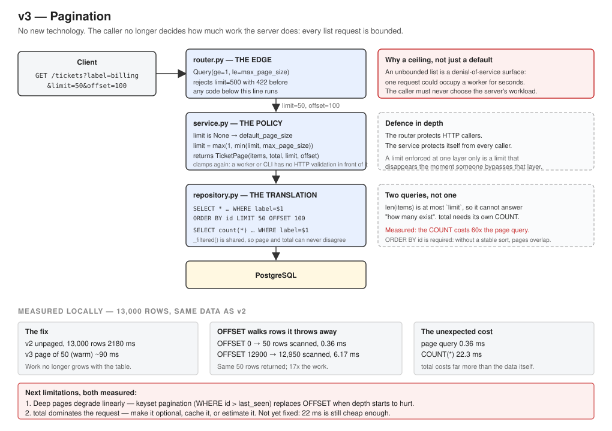

# Version v3 — Pagination

Branch: `v3-pagination`
API version: `0.3.0` · Model version: `v0.1.0` (unchanged)
Status: complete

## Problem

`GET /tickets` returned every row that matched. Measured in v2 with 13,000 tickets in the
table: **2.18 seconds**, roughly 13,000 Pydantic objects built, and one very large response.

Three separate problems hide inside that number:

1. **Latency grows with the table.** At 100,000 tickets it would be around 17 s; at a million
   the process runs out of memory.
2. **One client can occupy the server.** Measured throughput is about 44 req/s; a single unpaged
   list request holds a worker thread for two seconds. A handful of them make the API unusable
   for everyone else.
3. **The caller chose how much work the server did.** There was no upper limit anywhere in the
   code. That is the shape of a denial-of-service surface, whether or not anyone means harm.

The third point is the one that makes this more than a performance task. Optimising is
optional; removing an unbounded input is not.

## Current Architecture

v2: a stateless FastAPI process, PostgreSQL as the system of record, repository → service →
router layers. `list()` had no notion of a limit at any layer, so there was nowhere the
question "how much is too much?" could even be answered.

## Why the Old Design Is Not Enough

The endpoint's cost was a function of the data, not of the request. Adding an index or a faster
machine changes the constant, not the shape: any unbounded list endpoint eventually fails, and
fails worst exactly when the system is most successful.

## Solution

Offset pagination, with a ceiling enforced twice.



```
GET /tickets?label=billing&limit=50&offset=100
  → router:     validate (422 if limit > max_page_size)
  → service:    apply default, clamp, call repository twice
  → repository: SELECT … ORDER BY id LIMIT 50 OFFSET 100
                SELECT count(*) … (same filters)
  → response:   { total, limit, offset, items: [...] }
```

| Layer | New responsibility |
|---|---|
| `router.py` | `Query(ge=1, le=max_page_size)` — rejects an oversized request before any code runs |
| `service.py` | Applies the default, clamps the limit, returns a `TicketPage` |
| `repository.py` | `LIMIT`/`OFFSET` in SQL; `count()` now takes the same filters |
| `schemas.py` | `TicketListResponse` gained `limit` and `offset` |
| `config.py` | `default_page_size` (50) and `max_page_size` (200) |

## Why This Solution?

**Offset pagination rather than keyset.** Keyset pagination (`WHERE id > last_seen LIMIT n`) is
faster at depth and stable while rows are inserted. It was not chosen, because `OFFSET` being
slow at depth is a problem that had not been measured. It has now — see Measurements — and the
degradation is real but small at this size. Choosing the more complex design before the simpler
one hurts would have been guessing.

**A ceiling, not only a default.** A default protects well-behaved clients. A ceiling protects
the server. The difference matters because the caller is not necessarily cooperative, and even
a cooperative one can have a bug.

**Enforced at two layers.** The router validates, and the service clamps again. The router only
protects HTTP callers; when a background worker calls `service.list()` directly there is no
FastAPI in the path. A limit enforced in one place disappears the moment something bypasses
that place.

**422 rather than silent clamping.** A client asking for 500 rows is told its request was
invalid, instead of quietly receiving 200 and possibly concluding the table is smaller than it
is.

**`ORDER BY id` is load-bearing.** Without a deterministic sort, "the first 50 rows" is whatever
the database returns, and consecutive pages can overlap or skip. `id` is immutable and unique,
which makes it safe to sort by.

**One `_filtered()` shared by `list()` and `count()`.** If the two drifted, the API would report
a total describing a different set of rows than the page returned, and a client looping through
pages would stop early or never stop. Sharing one function makes that impossible by
construction rather than by discipline.

See ADRs: [ADR-010](../adr/ADR-010-offset-pagination.md),
[ADR-011](../adr/ADR-011-bounded-work-per-request.md).

## New Trade-offs

- **Clients must loop.** Fetching everything now takes several requests.
- **`total` costs a second query, and it is expensive.** Measured at 22.3 ms against 0.36 ms for
  the page itself — about 60× the cost of the data being returned.
- **`OFFSET` does hidden work.** `OFFSET 12900` makes PostgreSQL walk 12,950 index entries and
  discard 12,900 of them, for the same 50 rows returned.
- **Pages can shift.** A ticket inserted while a client is on page 3 moves rows between pages,
  so a row can be seen twice or skipped. Sorting by an immutable id limits the damage; it does
  not remove it.
- **The test double hides a cost.** `InMemoryTicketRepository` implements offset as a Python
  slice, which is instant. No test against the fake can reveal `OFFSET` degradation.

## What Changed

- `app/core/config.py` — `default_page_size: int = 50`, `max_page_size: int = 200`;
  `app_version` → `0.3.0`
- `app/tickets/repository.py` — `list()` takes `limit`/`offset` and applies `ORDER BY id`;
  `count()` now accepts the same filters as `list()`; both share a new `_filtered()` helper
- `app/tickets/service.py` — new frozen `TicketPage` dataclass; `list()` applies the default,
  clamps `limit` and `offset`, and issues both queries
- `app/tickets/schemas.py` — `TicketListResponse` gained `limit` and `offset`
- `app/tickets/router.py` — `limit` and `offset` query parameters with `ge`/`le` validation;
  `total` now comes from the count query instead of `len(items)`
- `app/tickets/dependencies.py` — passes the two new settings into the service
- `tests/fakes.py` — the fake repository supports `limit`/`offset` and filtered `count()`
- `tests/test_tickets_api.py`, `tests/test_ticket_service.py` — pagination tests added
- `.env.example` — the two new settings

### A latent bug fixed on the way

`count()` previously ignored the `label` and `needs_review` filters. Nothing had broken, because
the router computed `total` from `len(tickets)` and never called it. The moment `total` became a
real count, that mismatch would have produced a total describing the whole table while the page
described a filtered subset.

### An interface change that the type system did not catch

`TicketRepository` is a `typing.Protocol`, which is checked by static type checkers and not at
runtime. Changing the interface meant changing three implementations: the PostgreSQL one, the
in-memory fake, and a `BrokenRepository` defined inline inside a test. The third was missed and
only surfaced when the test suite ran.

This is the cost side of the repository pattern that ADR-005 named: an interface with N
implementations means every change is N changes, with no compiler reminding you. A type checker
in CI would have caught all three at once — a concrete trigger for adding one.

## How to Test

```bash
pytest -v
```

Manual, with the server running (`uvicorn app.main:app`):

```bash
curl "http://127.0.0.1:8000/tickets?limit=3"
curl "http://127.0.0.1:8000/tickets?limit=2&offset=2"
curl "http://127.0.0.1:8000/tickets?label=billing&limit=5"
curl "http://127.0.0.1:8000/tickets?limit=500"
```

Windows PowerShell:

```powershell
Invoke-RestMethod "http://127.0.0.1:8000/tickets?limit=3"
Invoke-RestMethod "http://127.0.0.1:8000/tickets?limit=500"
```

Load enough rows for the measurements to mean anything:

```bash
docker compose exec -T db psql -U support -d support_platform -c "INSERT INTO tickets (text, label, confidence, model_version, needs_review, created_at) SELECT 'generated ticket ' || i, (ARRAY['billing','technical_issue','account_access','feature_request'])[1 + i % 4], 0.5 + (i % 50)::float / 100, 'v0.1.0', i % 20 = 0, now() FROM generate_series(1, 13000) AS i;"
```

```bash
docker compose exec -T db psql -U support -d support_platform -P pager=off -c "EXPLAIN ANALYZE SELECT * FROM tickets ORDER BY id LIMIT 50 OFFSET 0;"
docker compose exec -T db psql -U support -d support_platform -P pager=off -c "EXPLAIN ANALYZE SELECT * FROM tickets ORDER BY id LIMIT 50 OFFSET 12900;"
docker compose exec -T db psql -U support -d support_platform -P pager=off -c "EXPLAIN ANALYZE SELECT count(*) FROM tickets;"
```

## Expected Result

- `pytest -v` collects and passes **70** tests.
- `GET /tickets` with no parameters returns at most 50 tickets and echoes
  `"limit": 50, "offset": 0`.
- `GET /tickets?limit=500` returns **422** with a message naming the ceiling:
  `"Input should be less than or equal to 200"`.
- `total` reports every matching ticket, independent of how many are in `items`.
- Walking pages with `offset` covers every ticket exactly once, with no duplicates or gaps.

## Measurements

All **measured locally**: Windows 11 laptop, PostgreSQL 17 in Docker, single uvicorn process,
13,000 rows — the same data used for the v2 measurement.

### The fix

| | Rows returned | Client-measured |
|---|---|---|
| v2, unpaged | 13,000 | **2180 ms** |
| v3, page of 50 (warm) | 50 | **~90 ms** |

The first request after loading the data measured 443 ms; that was a cold-cache effect, and the
warm figures (91.8 ms and 89.6 ms) are the honest ones. The client-side number also includes
PowerShell starting a cmdlet and deserialising JSON, so it overstates server time considerably:
the page query itself executed in 0.36 ms.

The important property is not the ratio. It is that the server's work is now a function of
`limit`, not of table size.

### `OFFSET` walks rows it then discards

Same page size, three depths:

| Offset | Rows the index scan actually walked | Execution time |
|---|---|---|
| 0 | 50 | 0.360 ms |
| 6,000 | 6,050 | 3.251 ms |
| 12,900 | 12,950 | 6.171 ms |

All three returned 50 rows. The deepest walked **17× more index entries** and threw almost all
of them away. The relationship is linear in `offset + limit`, exactly as the mechanism predicts.

Through the API the same two requests measured 91.8 ms and 89.6 ms — indistinguishable, because
6 ms disappears into HTTP and client overhead. The degradation is real, provable in the query
plan, and not yet observable end to end at this table size. That is why keyset pagination was
not built today.

### `total` costs more than the data

```
Page query:   Execution Time  0.360 ms
COUNT query:  Execution Time 30.029 ms   (actual 22.297 ms)
```

About **60× the cost of the page it accompanies**, and every list request pays it.

The plan is worth reading: PostgreSQL chose `Index Only Scan using ix_tickets_label` — counting
via the label index rather than the table, because that index is smaller, with `Heap Fetches: 0`
meaning it never touched the rows. It still read all 13,000 entries. PostgreSQL cannot store a
row count, because under MVCC the number of visible rows depends on which transaction is asking.

This contradicts the assumption made when the feature was designed, where `total` was expected
to be a minor cost. It is the dominant cost.

### Tests

70 passing (~14 s), up from 47. The new ones cover default page size, `limit`, `offset`,
complete page coverage with no duplicates or gaps, an offset past the end, the rejected ceiling,
six invalid parameter combinations, filters combined with paging, and service-level clamping
including boundary values.

## Interview Explanation

> "In v2 I measured that listing tickets returned the whole table — 13,000 rows in 2.18 seconds.
> That is three problems, not one: latency that grows with the data, a single request that
> occupies a worker for seconds, and an endpoint where the caller decides how much work the
> server does. The third makes it a denial-of-service surface, so it is not optional work.
>
> I added offset pagination with a server-side ceiling, enforced in two places: FastAPI rejects
> an oversized limit with 422 before any handler runs, and the service clamps it again because a
> background worker calling the service directly has no HTTP validation in front of it. A page
> of 50 is about 90 milliseconds end to end and 0.36 milliseconds in the database, and the cost
> no longer depends on table size.
>
> I deliberately chose offset over keyset pagination, then measured the reason keyset exists:
> OFFSET 12900 makes PostgreSQL walk 12,950 index entries to return 50 rows — 17 times the work
> of the first page, growing linearly. At 13,000 rows that is 6 milliseconds and invisible
> through HTTP, so switching now would have been complexity without a trigger. I wrote the
> number down so the trigger is a measurement rather than a hunch.
>
> The result I did not expect was that `total` costs more than the data. The COUNT query is
> 22 milliseconds against 0.36 for the page — roughly sixty to one — because PostgreSQL has to
> read every matching row to count them under MVCC. I have not fixed it yet, because 22
> milliseconds is still cheap, but it is now the clearest candidate for the next change: make
> total optional, cache it, or estimate it.
>
> The version added no new technology, which was the point. The fix was a bounded interface, not
> another component."

## Next Possible Limitation

1. **`total` dominates the request.** Measured at 60× the page query. Options: make it optional
   (`?include_total=false`), cache it per filter combination, use PostgreSQL's planner estimate
   for large tables, or return "more results available" instead of an exact count.
2. **Deep pages degrade linearly.** Keyset pagination removes it, at the cost of losing
   "jump to page N". The trigger is when deep pages appear in real traffic, or when the table
   is large enough that the degradation is visible end to end.
3. **Pages shift under concurrent writes.** Inserting during a client's walk can cause a row to
   be seen twice or missed. Keyset pagination on an immutable key also solves this.
4. **No type checking across the repository interface.** Three implementations, an interface
   change, and only the test run caught the mismatch. Adding mypy or Pyright would move that to
   before the code runs.
5. **Newest-first is probably the right default order.** The list is sorted by ascending id,
   which means the oldest tickets come first — rarely what a support queue wants. Changing it
   is a product decision, and it interacts with pagination stability.
6. **Still serial inference per process**, unchanged since v0.
