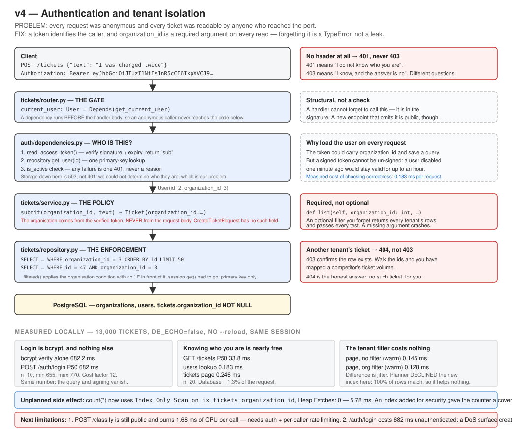

# v4 — Authentication and tenant isolation

API 0.4.0 · model v0.1.0 unchanged · 99 tests passing



## Problem

Every request was anonymous.

Not "weakly authenticated" — there was no concept of a caller at all. No column in any
table recorded who created a row, and any client that could reach port 8000 could read and
write every ticket in the system. Three concrete consequences:

- A support agent could change a ticket's routing and nothing recorded that they had.
- Two customer organisations could not both use the platform, because their tickets would
  sit in one undivided pile.
- `GET /tickets` returned everything, to anyone.

## Current Architecture

Before this version:

```
Client → router.py → service.py → repository.py → PostgreSQL
```

Three layers, bounded page sizes (v3), durable storage (v2), a repository interface (v1).
Complete, measured, and open to the world.

## Why the Old Design Is Not Enough

This is the one version so far whose trigger is **not a measurement**, and that is worth
stating plainly rather than inventing a number for.

The trigger is a **precondition**. v5 introduces documents — the knowledge base this
platform is named after. Documents belong to an organisation. The moment retrieval can
pull organisation A's internal document into an answer for organisation B, that is a data
breach, not a bug.

There is also a timing argument that overrides the project's usual "wait for the
measurement" rule:

> Adding an owner column to a table with 10 rows is a migration. Adding it to a table with
> 10 million rows is a backfill, a nullable-then-NOT-NULL dance, a decision about orphaned
> rows, and an audit of every query written without it.

Security work has a cost curve that runs the wrong way. So the rule needs a qualifier:
**wait for the trigger, but not past the point where the retrofit gets expensive.** For
ownership, that point is *the first data that has an owner*. This version is that moment.

Even at this size the retrofit was visible: the `tickets` table already held 13,000 rows,
so `organization_id NOT NULL` could not be applied directly (see *What Changed*), and 45
existing tests had to be given credentials.

## Solution

Identity becomes a first-class concept, in three stages on one branch.

**Stage 1 — schema.** `organizations` and `users` tables; `tickets.organization_id`
added as `NOT NULL` with a foreign key and an index.

**Stage 2 — credentials.** `POST /auth/register` and `POST /auth/login`. Passwords are
hashed with bcrypt; a successful login returns a signed JWT.

**Stage 3 — enforcement.** A `get_current_user` dependency resolves the caller from the
token on every protected endpoint, and `organization_id` becomes a **required** parameter
on every service and repository read.

## Why This Solution?

### Organisation as the tenancy boundary, not user

Maya's tickets belong to her company, not to her personally. If she leaves, the tickets
stay. So `organization_id` goes on `tickets`, not `user_id`. This single choice decides
what "can I see this?" means for the rest of the project. Per-user visibility, when it is
needed, becomes an additional filter inside an organisation — not a replacement for it.

### The filter is required, not optional

There are two ways to write this:

```python
def list(self, organization_id: int | None = None, ...)   # forget it → every tenant's rows
def list(self, organization_id: int, ...)                 # forget it → TypeError
```

The second. **A missing required argument is a crash at the call site; an optional filter
that defaults to "no filter" is a silent data leak that every existing test still passes.**
The safest rule is the one that cannot be forgotten, so `organization_id` comes first and
has no default. In `_filtered()` the organisation condition has no `if` in front of it,
unlike `label` and `needs_review` — there is no legitimate caller who wants every
organisation's rows.

### Another tenant's ticket returns 404, not 403

`403 Forbidden` means "that exists and you cannot have it" — which confirms it exists.
Walk the ids and you have mapped a competitor's ticket volume. `404 Not Found` is
indistinguishable from an id that was never used. Across a tenant boundary, **existence is
itself information**, so 404 is the honest answer. See ADR-015.

### The token carries the user id and nothing else

Putting `organization_id` in the token would save a database query per request. It would
also mean a user disabled one minute ago stays valid for up to an hour, because a signed
token cannot be un-signed.

| | Trust the token | Load the user each request |
|---|---|---|
| Queries per request | 0 | 1 primary-key lookup |
| Disabling a user takes effect | when the token expires | immediately |

Measured, the lookup costs **0.183 ms** against a 33.8 ms request. Correctness for 0.5% of
the request is not a hard trade. This is also the standing weakness of JWTs: revocation
always needs something outside the token.

### bcrypt directly, not passlib

`passlib` wraps a dozen hash algorithms we will never use, and its 1.7.x releases break
against modern `bcrypt`. We need one algorithm. Using `bcrypt` directly is fewer moving
parts and keeps the mechanics visible — the per-password salt, the cost factor, and the
72-byte limit that would otherwise truncate silently.

## New Trade-offs

**Gained:** data has an owner; the tenant boundary is enforced in SQL rather than in
handler code; a disabled account stops working immediately; `is_active` means something.

**Lost, or newly owed:**

- **Login is now the most expensive endpoint in the system**, at 682 ms — roughly 30× a
  ticket write, and reachable without credentials. That is a denial-of-service surface
  this version created. Rate limiting on `/auth/login` moves from "nice to have" to a
  named gap with a measured cost behind it.
- **The test suite went from ~7 s to 102.92 s**, ~60% of it bcrypt (see *Measurements*).
  Both fixes — a lower cost factor in tests, or session-scoping registration — trade away
  something real.
- **A new endpoint that omits `Depends(get_current_user)` is silently public.** Nothing in
  Python catches that. The parametrised 401 test covers today's routes, not tomorrow's.
- **A secret now exists.** `JWT_SECRET_KEY` has no default, so the app refuses to start
  without it. If it leaks, every token is forgeable.
- **No token revocation, no refresh, no password reset, no logout.** All real, all deferred.
- **`POST /classify` is still public** — see *Next Possible Limitation*.

## What Changed

### New files

| File | Purpose |
|---|---|
| `app/auth/models.py` | `Organization`, `User` |
| `app/auth/security.py` | bcrypt hashing, JWT signing and verification |
| `app/auth/schemas.py` | request/response shapes — none of which has a password field |
| `app/auth/repository.py` | storage for organisations and users |
| `app/auth/service.py` | registration and login rules |
| `app/auth/dependencies.py` | wiring plus `get_current_user` |
| `app/auth/router.py` | `POST /auth/register`, `POST /auth/login` |
| `app/core/errors.py` | `StorageError` moved here, plus `AlreadyExistsError` |
| `alembic/versions/2f7c4a91b3de_*.py` | the migration |
| `tests/test_auth_api.py` | 16 tests |

### `StorageError` moved to `app/core/errors.py`

It lived in `app/tickets/repository.py`. Once the auth module needed the same idea, leaving
it there would have made `app/auth` depend on `app/tickets` for no reason. **A concern
shared by two modules belongs in core.**

`AlreadyExistsError` is new and deliberately **not** a subclass of `StorageError`: the
router turns `StorageError` into 503 "try again later", and a duplicate email is not a
temporary condition. Different cause, different status, different type.

### The migration needed three steps, not one

`--autogenerate` produces `nullable=False` on the new column, and that statement fails
against a table that already holds rows — PostgreSQL cannot invent a value for them.

```python
# 1. add the column, temporarily nullable
op.add_column("tickets", sa.Column("organization_id", sa.Integer(), nullable=True))

# 2. give every existing row an owner
op.execute("INSERT INTO organizations (name, created_at) VALUES ('default', now())")
op.execute("UPDATE tickets SET organization_id = "
           "(SELECT id FROM organizations WHERE name = 'default')")

# 3. now the constraint can be enforced, and the FK validated against correct data
op.alter_column("tickets", "organization_id", nullable=False)
op.create_foreign_key("fk_tickets_organization_id", "tickets", "organizations",
                      ["organization_id"], ["id"])
```

**A migration is not a description of the schema you want. It is a sequence of operations
that must each be legal at the moment it runs.** Order is part of the design.

### `session.get()` had to go

```python
# before
return self._session.get(Ticket, ticket_id)

# after
return self._session.scalar(
    select(Ticket).where(Ticket.id == ticket_id,
                         Ticket.organization_id == organization_id)
)
```

`session.get()` looks up by primary key only — there is no room for a second condition.
**Adding an authorization boundary made a convenience method unusable.** That is normal,
and it is part of what "retrofitting security is expensive" actually means in practice.

### Column order does not match model order

`\d tickets` shows `organization_id` **last**, although the model lists it second.
`ALTER TABLE ADD COLUMN` appends; PostgreSQL stores columns in physical order and cannot
insert one in the middle. Harmless here because SQLAlchemy always names columns
explicitly — it would bite code relying on `SELECT *` positionally.

### Tests

`tickets_client` kept its name but now registers an organisation and attaches a token. The
fixture's job was always "a client that can use the tickets API"; that now includes
credentials. Renaming it would have touched 68 call sites for no behavioural gain. New
`anonymous_client` (so the refusal path is still exercised) and `second_org_client` (the
only fixture that can prove isolation).

`BrokenRepository`, the inline double in `test_tickets_api.py`, needed its signatures
updated — **the same double that was missed in v3** when the protocol gained `limit`/
`offset`. A `Protocol` has no runtime enforcement, so N implementations means N manual
edits with no compiler help. Still the strongest argument in this repository for a type
checker.

## How to Test

```bash
docker compose up -d
```

```bash
alembic upgrade head
```

```bash
pytest -v
```

```bash
uvicorn app.main:app
```

Register, then log in:

```bash
curl -X POST http://127.0.0.1:8000/auth/register -H "Content-Type: application/json" -d '{"organization_name": "Acme", "email": "maya@acme.com", "password": "correct-horse-battery"}'
```

```bash
curl -X POST http://127.0.0.1:8000/auth/login -H "Content-Type: application/json" -d '{"email": "maya@acme.com", "password": "correct-horse-battery"}'
```

The refusal, which matters more than the happy path:

```bash
curl -i http://127.0.0.1:8000/tickets
```

Verify nothing readable is stored:

```bash
docker compose exec db psql -U support -d support_platform -c "SELECT id, email, password_hash FROM users;"
```

## Expected Result

| Request | Result |
|---|---|
| register | 201, email lowercased, **no password field of any kind** |
| login | 200, `access_token`, `token_type: "bearer"`, `expires_in_seconds: 3600` |
| register again | 409 — a conflict, not a 503; retrying cannot help |
| login, wrong password | 401 `"Incorrect email or password"` |
| login, unknown email | 401, **identical wording** |
| register, 5-character password | 422 from pydantic before any code runs |
| `GET /tickets` with no token | 401 `{"detail":"Not authenticated"}` + `WWW-Authenticate: Bearer` |
| `SELECT password_hash` | `$2b$12$…` — version `2b`, cost factor 12, no trace of the password |

Paste a token's middle segment into a base64 decoder and it reads out **without any key**:

```
{'sub': '2', 'exp': 1790295262, 'iat': 1790291662}    lifetime 3600 s
```

That is not a flaw. It is what "signed, not encrypted" means, and seeing it is the fastest
way to remember never to put a secret in a token.

## Measurements

All measured locally: Windows 11, PostgreSQL 17 in Docker, 13,000 tickets,
`DB_ECHO=false`, uvicorn without `--reload`, one worker. The HTTP numbers use a Python
`httpx` client — an earlier attempt with PowerShell's `Invoke-RestMethod` reported 2174 ms
for a 682 ms request, because the client added ~1500 ms of its own. **An instrument has to
be cheaper than the thing it measures.**

### Login is bcrypt and nothing else

| | Measured |
|---|---|
| `bcrypt.checkpw` alone, cost factor 12 | **682.2 ms** |
| `POST /auth/login` P50, n=10 | **682 ms** (min 655, max 770) |

The same number. The email lookup and the token signing disappear into rounding. This is
the clearest measurement in the version: the endpoint *is* the hash.

### Knowing who the caller is costs 0.18 ms

| | Measured |
|---|---|
| `GET /tickets` P50, n=20 | 33.8 ms (min 29.4, max 41.2) |
| `users` lookup — `Index Scan using users_pkey` | **0.183 ms** |
| tickets page query | 0.246 ms |
| database total | 0.429 ms — **1.3% of the request** |

The remaining 33.4 ms is Python, ASGI, Pydantic serialisation and loopback. Worth stating
on its own: **the database is not the bottleneck in this system and never has been.**

No comparison is drawn against v3's ~90 ms for the same endpoint. Different session, and
`DB_ECHO` and `--reload` both changed — invalid by the project's own rule.

### The tenant filter is free

Each query run twice; the second of each pair is reported, because the first paid for cold
buffers (2.529 ms and a 2.043 ms planning time — which read naively would have "proved"
that adding a `WHERE` clause made the query 10× faster).

| Query, warm | Execution |
|---|---|
| `ORDER BY id LIMIT 50` | 0.145 ms |
| `WHERE organization_id = 1 ORDER BY id LIMIT 50` | **0.128 ms** |

The difference is jitter — the filtered query is marginally *lower*, which is how you know
it is noise rather than a real gap.

### The planner declined the new index, correctly

```
WHERE organization_id = 1 ORDER BY id LIMIT 50
  →  Index Scan using tickets_pkey
     Filter: (organization_id = 1)
```

`ix_tickets_organization_id` was ignored. Right decision: every row is in organisation 1,
so the index selects 100% of the table and helps nothing, while `tickets_pkey` supplies
the `ORDER BY id` ordering for free. **An index is a possibility the planner may decline,
not an instruction.** This was predicted before running the query, and the prediction held.

### Unplanned: the security index gave COUNT a covering index

```
count(*) WHERE organization_id = 1
  →  Index Only Scan using ix_tickets_organization_id
     Heap Fetches: 0
     Execution Time: 5.782 ms
```

`Heap Fetches: 0` means PostgreSQL answered the count **without reading the table at
all**. A narrow index — one 4-byte integer plus a row pointer — is far less I/O than
13,000 full ticket rows.

v3 recorded this COUNT at 22.3 ms and made it the headline next problem. **No speedup is
claimed here**: that was a different session, and a v1 benchmark was discarded for exactly
that reason. What can be claimed is that the *plan* is structurally different and better,
for a reason that is explainable after the fact and was not predicted before it. An index
added for authorization incidentally improved the counter.

### The cost of bcrypt, visible in the test suite

| | v3 | v4 |
|---|---|---|
| Tests | 70 | **99** |
| Runtime | ~7 s | **102.92 s** |

Not overhead — arithmetic. Each `tickets_client` fixture registers (one hash) and logs in
(one verify): ~1.36 s. Roughly 45 tests use it.

```
45 × 1.36 s ≈ 61 s     ≈ 60% of the total runtime
```

A hash fast enough to be free in tests is a hash fast enough to brute-force in production.

## Interview Explanation

> Authentication was scheduled for v3 in my original plan and I didn't build it, because
> nothing measured demanded it. v2's numbers instead surfaced an unbounded list endpoint
> returning 13,000 rows in 2.18 seconds, so v3 became pagination. Authentication landed at
> v4 for a different kind of reason: not a measurement, but a precondition. v5 adds
> documents, documents belong to an organisation, and cross-tenant retrieval is a breach
> rather than a bug — and ownership is cheap to add to a table with 13,000 rows and
> expensive to add to one with 10 million.
>
> The design decision I'd defend hardest is that `organization_id` is a **required**
> parameter on every repository read, not an optional filter. An optional filter you forget
> returns every tenant's data and passes every existing test. A required argument you forget
> is a `TypeError`. I made the unsafe version impossible to write rather than discouraged.
>
> The second is returning **404 rather than 403** for another organisation's ticket. 403
> confirms the row exists, and across a tenant boundary existence is itself information.
>
> I chose to load the user row on every request rather than putting `organization_id` in the
> token. That costs one primary-key lookup — measured at 0.183 ms against a 33.8 ms request
> — and it buys immediate effect for disabling an account. A signed token cannot be
> un-signed, so revocation always needs something outside it.
>
> Two things I got wrong or did not foresee. I expected PostgreSQL to use the new
> `organization_id` index for the page query; it declined, correctly, because every row
> matched. And the same index turned `count(*)` into an `Index Only Scan` with zero heap
> fetches, partially improving the problem I had written up as v4's headline issue — an
> accident I can explain but did not predict.
>
> The honest cost: login is now the most expensive endpoint in the system at 682 ms, all of
> it bcrypt, and it is reachable without credentials. This version created a
> denial-of-service surface, and rate limiting is the answer.

## Next Possible Limitation

1. **`POST /classify` is still public.** It stores nothing and owns no data, so there is
   no tenant boundary to cross — but it runs a model. Inference is 1.68 ms of CPU and
   throughput ceilings around 80 req/s, so an anonymous caller can consume all of it. That
   is the same *category* of problem v3 fixed for `GET /tickets`, with compute instead of
   rows. Trigger: the moment this runs anywhere other than localhost.

2. **`/auth/login` is a 682 ms unauthenticated request.** Correct for password security,
   and a denial-of-service surface. Needs per-caller rate limiting — which ADR-011 already
   noted pagination does not provide.

3. **No token revocation.** A stolen or disabled user's token stays valid until it expires.
   The fixes — a short expiry plus refresh tokens, or a revocation list in Redis — each
   add a component.

4. **`total` still costs more than the page**: 5.78 ms against 0.128 ms. Improved by
   accident, not solved.

5. **Still no type checker.** `BrokenRepository` broke for the second consecutive version
   for the same structural reason.

6. **Test suite at 103 s** is approaching the point where it stops being run often enough.

7. **No per-user visibility inside an organisation, and no roles.** Every member of an
   organisation sees everything it owns. Fine now; an audit requirement ("who reviewed
   this ticket?") is the trigger.
