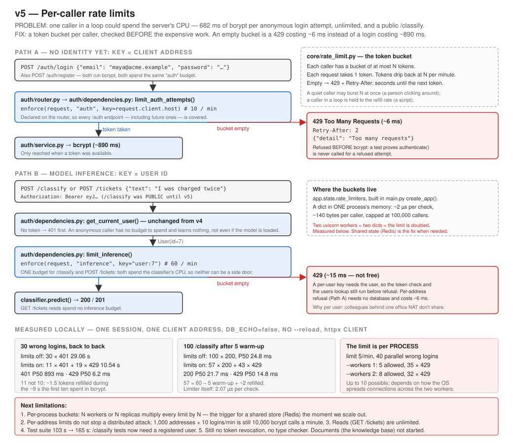

# v5 — Per-caller rate limits

One caller can no longer spend the server's CPU without bound. Every expensive endpoint now has
a budget per caller, checked **before** the expensive work runs.



## What this version adds

- `app/core/rate_limit.py` — a token bucket per caller: at most *N* tokens, one per request,
  refilled at *N* per minute. Empty → `429 Too Many Requests` with `Retry-After`
- `/auth/login` and `/auth/register`: **10 per minute per client address** (both run bcrypt)
- `/classify` and `POST /tickets`: **60 per minute per user**, one shared budget
- `/classify` **now requires a token** — it was the last anonymous inference endpoint
- Reads (`GET /tickets`) are not limited in this version

## Run

```bash
docker compose up -d
```

```bash
uvicorn app.main:app
```

Limits are configurable in `.env` (defaults shown):

```
RATE_LIMIT_ENABLED=true
AUTH_RATE_LIMIT_PER_MINUTE=10
INFERENCE_RATE_LIMIT_PER_MINUTE=60
```

## Try it

Eleven bad logins from one terminal — ten slow `401`s (bcrypt), then an instant `429`:

```bash
for i in $(seq 1 11); do curl -s -o /dev/null -w "%{http_code}\n" -X POST http://127.0.0.1:8000/auth/login -H "Content-Type: application/json" -d '{"email":"nobody@acme.example","password":"wrong-password-guess"}'; done
```

```bash
curl -i -X POST http://127.0.0.1:8000/auth/login -H "Content-Type: application/json" -d '{"email":"nobody@acme.example","password":"x"}'
```

The last one shows `HTTP/1.1 429 Too Many Requests` and `retry-after: <seconds>`.

## Test

```bash
pytest -v
```

120 tests. The two worth reading:

`test_a_refused_login_never_reaches_bcrypt` — counts calls to `AuthService.authenticate`. A
limiter that ran *after* the password check would pass every status-code test and protect
nothing; this one proves the ordering.

`test_classify_and_ticket_submission_share_one_inference_budget` — two classifications and one
ticket spend a budget of three, then **both** routes answer 429, and the refused ticket stored
nothing.

## Results (measured locally, one session, `DB_ECHO=false`, no `--reload`, httpx client)

| | Before (limits off) | After |
|---|---|---|
| 30 wrong logins, one client | 29.06 s, all bcrypt | **10.54 s** — 11 × 401, 19 × 429 |
| cost of a refused login | 891 ms (a full bcrypt) | **6.2 ms** P50 |
| 100 `/classify`, one user | 100 × 200 | 57 × 200, 43 × 429 (**14.8 ms** P50) |
| limiter check | — | **2.07 µs** |
| limit 5/min, `--workers 1` | — | 5 allowed |
| limit 5/min, `--workers 2` | — | **8 allowed** — buckets are per process |

The last row is the version's main limitation, measured rather than assumed: every extra worker
or replica adds its own full budget. A shared store (Redis) is the fix, triggered by scaling out.

## Documents

- Full version document: [v5-rate-limiting.md](../v5-rate-limiting.md)
- [ADR-016 — In-process token bucket for rate limiting](../../adr/ADR-016-in-process-token-bucket.md)
- [ADR-017 — Rate-limit keys: address for auth, user for inference](../../adr/ADR-017-rate-limit-keys.md)
- Previous version: [v4 — Authentication](../v4-authentication.md)
