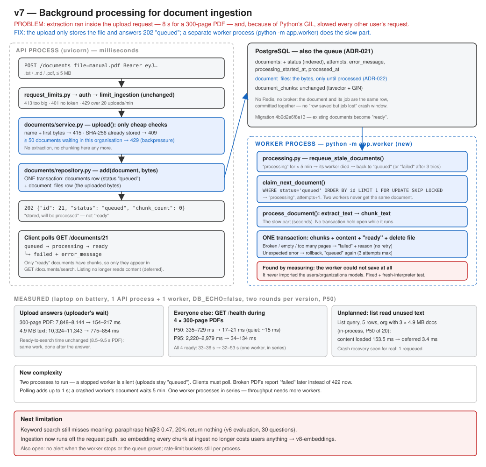

# v7 — Background processing for document ingestion

API 0.7.0 · model v0.1.0 unchanged · 196 tests passing



## Recap: where v6 left us

Sam, a support lead at Acme, uploads the 300-page product manual so the team can search it. In v6
the upload request did everything itself: read the PDF, split it into 1,250 chunks, and saved them.
Sam's browser showed a spinner for **8 seconds**. Worse, Maya was classifying tickets at the same
moment, and her requests became slow too. While four large PDFs were being processed, a simple
`GET /health` took **P50 335–729 ms instead of 15 ms, and up to 3.3 s**.

What changed in v6: `POST /documents` → `service.ingest` → `extraction.py` → `chunking.py` →
`repository.add` (document + chunks in one transaction) → 201. Everything ran inside the request.

What was still wrong: the slowest thing a user can ask for was done while they waited, and in the
same process that serves everyone else.

## Problem

1. **The uploader waits for work they do not need to watch.** 7.8–8.1 s for a 300-page PDF and
   10.3–11.3 s for a 4.9 MB text file (P50, this session).
2. **Everyone else waits too.** Extraction is CPU work in Python. Python runs one thread of
   Python code at a time per process (the **GIL**, Global Interpreter Lock), so the thread pool
   does not help. A CPU-heavy upload slows every other request in the process.
3. **v8 will make it worse.** Computing embeddings at ingest time adds more CPU work per chunk.

## Current Architecture

```
POST /documents → router → service.ingest → extract → chunk → INSERT document + chunks → 201
                  (all inside one HTTP request, in the API process)
```

## Why the Old Design Is Not Enough

A faster PDF reader would shorten the wait but not remove it. The problem is *where* the work
runs. As long as extraction happens inside the API process, a big enough upload will always slow
other users' requests. The work has to move to a different process, and then three new questions
need answers:

- Where does the file wait between the upload and the processing?
- How does the worker find the next job, and how do two workers avoid doing the same one?
- How does the user find out that the document is ready, or why it failed?

## Solution

```
UPLOAD (API process, milliseconds)
  POST /documents + file
    ▼ request_limits.py   413 if too big (unchanged)
    ▼ auth + limit_ingestion (unchanged)
    ▼ service.upload      type from name + first bytes → 415
                          SHA-256 duplicate → 409
                          organisation has ≥ 50 documents waiting → 429 (backpressure)
    ▼ repository.add      ONE transaction: documents row (status "queued") + document_files row (the bytes)
  202 {"id": 21, "status": "queued", "chunk_count": 0, ...}

PROCESSING (worker process: python -m app.worker)
  loop:
    requeue_stale_documents   "processing" for more than 5 min → worker died → back to "queued"
    claim_next_document       SELECT ... WHERE status='queued' ORDER BY id LIMIT 1
                              FOR UPDATE SKIP LOCKED → status "processing", attempts + 1
    process_document          read bytes → extract_text → chunk_text   (the slow part, no DB)
                              ONE transaction: chunks + content + status "ready" + delete the file
                              or: status "failed" + error_message (broken PDF, no text, too many pages)
    nothing queued → sleep 1 s

FOLLOWING PROGRESS (client)
  GET /documents/21 → {"status": "queued" | "processing" | "ready" | "failed", "error_message": ...}
```

Files:

| File | What it does now |
|---|---|
| `app/documents/models.py` | `Document` gains `status`, `error_message`, `attempts`, `processing_started_at`, `processed_at`; `content` becomes nullable and **deferred**; new `DocumentFile` table |
| `alembic/versions/4b9d2e6f8a13_...py` | adds the columns (existing documents become `ready`), the `status` index and `document_files` |
| `app/documents/service.py` | `ingest` → `upload`: only fast checks, then store as `queued` |
| `app/documents/repository.py` | `add(document, data)` writes document + file together; new `count_pending` |
| `app/documents/processing.py` | **new**: claim, process, retry, rescue abandoned documents |
| `app/worker.py` | **new**: the loop, `python -m app.worker` |
| `app/documents/router.py`, `schemas.py` | 202 Accepted; 429 when the queue is full; status fields in every response |
| `app/core/config.py` | `WORKER_POLL_SECONDS`, `WORKER_STALE_AFTER_SECONDS`, `WORKER_MAX_ATTEMPTS`, `MAX_PENDING_DOCUMENTS_PER_ORGANIZATION` |

## Why This Solution?

**Why a separate process?** It is the only option that removes the GIL problem. FastAPI's
`BackgroundTasks` runs after the response is sent, but in the same process, so it would still
slow other requests. It would also lose the job if the process restarted.

**Why PostgreSQL as the queue, not Redis + Celery?** ([ADR-021](../adr/ADR-021-postgres-table-as-job-queue.md))

- There is no new service to run: the queue is the `status` column of the documents table.
- The document and its job are written in **one transaction**. With Redis, the row goes to
  PostgreSQL and the job goes to Redis in a separate step, and a crash between the two leaves a
  document that is never processed.
- `FOR UPDATE SKIP LOCKED` lets several workers share the queue safely. A worker that finds a
  locked row skips to the next one instead of waiting or taking the same one.

**Why the bytes wait in PostgreSQL, not object storage?** ([ADR-022](../adr/ADR-022-waiting-files-in-postgres.md))
They only wait there for seconds and are deleted after processing. They are written in the same
transaction as the document, and `ON DELETE CASCADE` removes them if the owner deletes a queued
document. MinIO would be a second system with no shared transaction.

**Why polling every second, not `LISTEN/NOTIFY`?** It is one indexed query a second, and a new
upload waits at most one extra second. Simple beats instant here.

### Failure-first: what happens when...

| Situation | What happens | Proved by |
|---|---|---|
| The file is broken, empty, encrypted, or has too many pages | `failed` + a readable `error_message`; no retry, because the same file fails the same way | `test_unreadable_files_fail_with_a_reason`, `test_a_pdf_over_the_page_limit_fails` |
| An unexpected error (a bug, the database blinks) | Rolled back with no partial chunks, back to `queued`; after 3 attempts → `failed` | `test_a_failure_while_saving_leaves_no_chunks_and_retries`, `test_repeated_failures_end_in_failed` |
| The worker crashes or is killed mid-document | The document stays `processing`; after 5 min it goes back to `queued` (or `failed` if it is out of attempts) | `test_a_document_abandoned_by_a_crashed_worker_is_requeued`; **also seen for real** (below) |
| A slow worker finishes after its document was handed to another worker | Its result is thrown away (the `attempts` number changed) | `test_a_worker_that_was_replaced_throws_its_result_away` |
| Two workers ask at the same moment | Each gets a different document (SKIP LOCKED) | `test_two_workers_never_take_the_same_document` |
| The owner deletes a document while it is being processed | The worker notices and discards its work | `test_a_document_deleted_during_processing_is_discarded` |
| The database is down | The worker logs, waits and tries again; it does not exit | `test_the_worker_loop_survives_errors` |
| The queue keeps growing | 429 once an organisation has 50 documents waiting | `test_a_full_queue_is_429` |
| The worker is not running at all | Uploads still succeed and wait as `queued`. Nothing is lost, but nothing becomes searchable either. **Nothing alerts anyone yet** | — (monitoring is a later version) |

## New Trade-offs

- **Two processes to run instead of one.** Forgetting to start the worker is a silent failure:
  uploads say `queued` forever.
- **The client has to poll.** "Uploaded" and "searchable" are now different moments. A client
  that searches right after uploading finds nothing.
- **Some errors arrive later.** A broken PDF used to be a 422 from the upload. Now it is a 202
  followed by `failed`. Type (415), size (413), duplicates (409) and a full queue (429) are still
  answered immediately, because checking them does not require reading the file.
- **One worker processes documents one at a time.** Four PDFs uploaded together took about as long
  in total as before (31.6–53.3 s vs 33.0–36.4 s). The gain is that *nobody else waits*, not that
  processing got faster. More throughput means more worker processes, which the design allows.
- **Crash recovery is slow.** A document abandoned by a dead worker waits 5 minutes before it is
  retried.

## What Changed

- 202 Accepted + status polling instead of 201 with a finished document.
- A worker process with claim / process / retry / rescue logic in about 200 lines, with no queue
  library.
- `documents.content` is **deferred** (not loaded unless read). This was an unplanned fix: see
  Measurements.
- **Bug found by measuring, not by the tests:** the worker process never imported the `users` and
  `organizations` models, so SQLAlchemy could not resolve the documents' foreign keys and every
  attempt failed with `could not find table 'users'`. The test suite missed it because the test
  process imports the whole app. Fixed in `app/worker.py`, with a regression test that imports the
  worker in a **fresh interpreter** (`test_the_worker_process_knows_every_table_it_writes`). The
  test was confirmed to fail without the fix.

## How to Test

```bash
docker compose up -d
alembic upgrade head
pytest -v
```

Run it by hand, with two terminals:

```bash
uvicorn app.main:app                      # terminal 1: the API
python -m app.worker                      # terminal 2: the worker
```

```bash
curl -X POST http://127.0.0.1:8000/documents -H "Authorization: Bearer $TOKEN" -F "file=@evaluation/knowledge_base/refund-policy.md"
curl -H "Authorization: Bearer $TOKEN" http://127.0.0.1:8000/documents/1
```

Measure (with `DB_ECHO=false` and `INGESTION_RATE_LIMIT_PER_MINUTE=1000` for the API):

```bash
python scripts/measure_async_ingestion.py
```

## Expected Result

- The upload answers **202** with `"status": "queued"` in well under a second.
- Within a second or two (small file) the worker logs `Document 1 ready: N chunks`, and
  `GET /documents/1` shows `"status": "ready"`.
- A `.pdf` that is not really a PDF → 415 at once. A corrupt PDF → 202, then `"status": "failed"`
  with `"error_message": "Could not read PDF: ..."`.
- With the worker stopped, uploads stay `queued`. Start it and they are processed.

## Measurements

Measured locally on a Windows 11 laptop **running on battery** (CPU load from other programs
19–71% during the session), PostgreSQL 17 in Docker, one uvicorn process, one worker, `DB_ECHO=false`,
no `--reload`, Python `httpx` client, `scripts/measure_async_ingestion.py`. v6 was run from an
export of the `main` branch against its own database, alternating with v7 in the same session.
Each version has **two valid rounds**, shown as a range. A third v7 round was discarded because the
laptop suspended mid-run: one request "took" 4,077 s.

**1. The uploader's wait** (P50 of 3 uploads each):

| | v6: upload answers | v7: upload answers | v7: document ready |
|---|---|---|---|
| PDF, 300 pages | 7,848–8,144 ms | **154–217 ms** | 8,518–9,543 ms |
| Text, 4.9 MB | 10,324–11,343 ms | **775–854 ms** | 9,834–11,360 ms |

The processing itself costs the same. It happens after the answer instead of before it. Up to one
second of the "ready" time is the worker's poll interval. The 4.9 MB answer is still ~0.8 s:
that is receiving, parsing and hashing 4.9 MB and writing it as one `bytea` value.

**2. Everyone else's wait**: `GET /health` sent continuously while 4 × 300-page PDFs are processed:

| | Quiet P50 | Busy P50 | Busy P95 | Busy max | All 4 ready |
|---|---|---|---|---|---|
| v6 | 15.1–18.0 ms | 335–729 ms | 2,220–2,979 ms | 2,936–3,284 ms | 33.0–36.4 s |
| v7 | 14.5–15.2 ms | **17.3–20.7 ms** | **34–134 ms** | 351–500 ms | 31.6–53.3 s |

The busy P50 is now within a few ms of quiet. The API process no longer runs the CPU work. What
remains is competition for the machine's CPU cores and the database, not for the GIL.

**3. Unplanned: listing read megabytes it never returned.** In v6, `GET /documents?limit=5` took
~198 ms against 44 ms for `limit=1` and 14 ms for `/health`, on an organisation holding three
4.9 MB text documents. SQLAlchemy loaded every column, including `content`, for each row, and the
response never included it. Timing the same list query in-process on the v7 database: **153.5 ms
with `content` loaded (v6 behaviour) → 3.4 ms deferred** (P50 of 20). This could not be seen in v6's
measurements, because they uploaded documents without listing them.

**4. Crash recovery, observed for real.** The discarded round's worker was killed while a document
was `processing`. When the next round's worker started, it logged `Abandoned documents: 1 requeued,
0 failed`, then finished that document and the two queued behind it. That is the same path the
test covers, happening outside a test.

## Interview Explanation

"In v6, a 300-page PDF upload took 8 seconds inside the HTTP request. Because extraction is CPU
work and Python has a GIL, it also slowed other users: health checks went from 15 ms to a P50 of
335–729 ms while four PDFs were processed. I moved the work into a separate worker process. The
upload now stores the file and a `queued` row in one transaction and returns 202 in about 200 ms.
The client polls the document's status. I used PostgreSQL itself as the queue, with
`SELECT ... FOR UPDATE SKIP LOCKED`, instead of adding Redis and Celery. It needs no new service,
and the document and its job are committed together, so the dual-write problem does not exist. I
designed for failure: file problems fail immediately with a reason, unexpected errors retry three
times, a crashed worker's document is rescued after a timeout, and a worker that was too slow
throws its result away. Other users' P50 during the load went back to about 20 ms. Total processing
time didn't improve, because one worker processes documents in series. That is a throughput
question, answered by running more workers. Measuring also found two bugs the tests had missed:
the list endpoint was reading megabytes of text per row, and the worker process could not save at
all, because it never imported two model modules."

## Next Possible Limitation

- **Keyword search still misses meaning** (paraphrase hit@3 0.47, 20% empty in v6). This is now the
  largest measured gap, and ingestion can absorb the extra cost of embeddings without users
  feeling it. **Trigger for v8-embeddings.**
- **Nobody notices a stopped worker.** Queue depth and the age of the oldest `queued` document are
  the first metrics the platform needs (observability, later).
- **Rate-limit buckets are still per process.** The worker is a second process but serves no
  HTTP, so the problem did not grow. It will when the API itself runs more than one process.
- **Polling costs up to 1 s of latency**, and **crash recovery costs 5 minutes**. Both are
  settings today, and `LISTEN/NOTIFY` or heartbeats if they ever matter.
