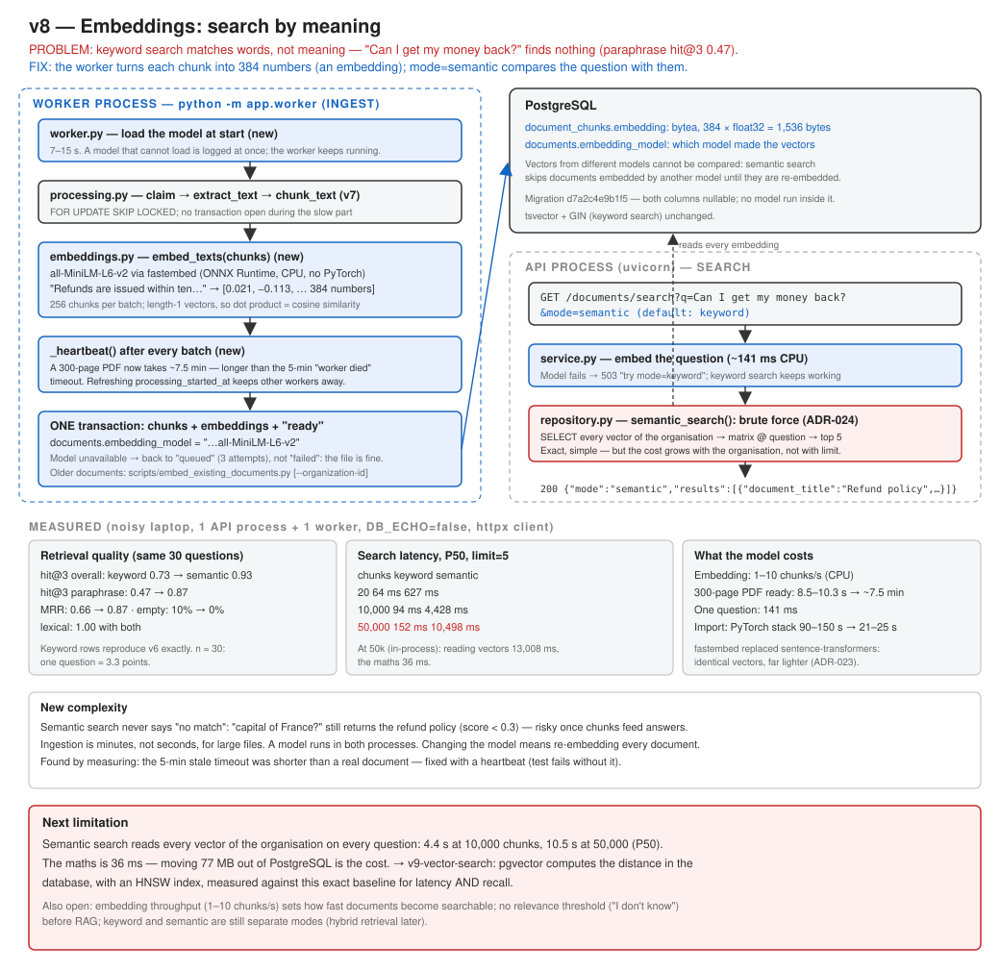

# v8: Embeddings (search by meaning)

Keyword search finds words. v8 adds search by **meaning**. The worker turns every chunk into an
embedding: 384 numbers from a small local model, `all-MiniLM-L6-v2`, run on the CPU by fastembed.
`GET /documents/search?mode=semantic` embeds the question and returns the chunks whose embeddings
are closest to it. "Can I get my money back?" now finds the refund policy.



## What this version adds

- `mode=semantic` on `GET /documents/search`. `mode=keyword` stays the default and is unchanged.
- An embedding for every chunk (`document_chunks.embedding`, 1,536 bytes). Each document also
  records the model that made its embeddings (`documents.embedding_model`).
- Embedding in the worker, in batches, with a **heartbeat**, so a document that takes minutes is not
  mistaken for one abandoned by a crashed worker.
- A model that cannot run gives **503 "try mode=keyword"** for search, and a retry (not `failed`)
  for processing.
- `scripts/embed_existing_documents.py`: gives embeddings to documents from before v8.

## Run

```bash
pip install -r requirements.txt
```

```bash
alembic upgrade head
```

```bash
uvicorn app.main:app
```

In a second terminal. The first start downloads the model, ~90 MB, into `models/embeddings`:

```bash
python -m app.worker
```

Documents uploaded before v8 still need embeddings:

```bash
python scripts/embed_existing_documents.py --organization-id 6
```

## Try it

```bash
curl -G http://127.0.0.1:8000/documents/search -H "Authorization: Bearer $TOKEN" --data-urlencode "q=Can I get my money back?"
```

```bash
curl -G http://127.0.0.1:8000/documents/search -H "Authorization: Bearer $TOKEN" --data-urlencode "q=Can I get my money back?" -d mode=semantic
```

The first command returns `"results": []`. The second returns the refund policy first.

## Test

```bash
pytest -v
```

Worth reading:

- `test_semantic_search_finds_a_paraphrase_that_keyword_search_misses`
- `test_semantic_search_always_returns_the_closest_chunks` (it never says "no match")
- `test_documents_embedded_by_another_model_are_not_compared`
- `test_a_long_embedding_keeps_the_document_alive` (the heartbeat; it fails when the heartbeat is
  switched off)

## Results (measured locally, on a noisy laptop)

| | v7 (keyword) | v8 (semantic) |
|---|---|---|
| hit@3, all 30 questions | 0.73 | **0.93** |
| hit@3, 15 paraphrases | 0.47 | **0.87** |
| Questions returning nothing | 10% | **0%** |
| Search P50, 20 chunks | 64 ms | 627 ms |
| Search P50, 50,000 chunks | 152 ms | **10,498 ms**, the trigger for v9 |
| 300-page PDF, upload → searchable | 8.5–10.3 s | ~7.5 min |

## Documents

- Full version document: [v8-embeddings.md](../v8-embeddings.md)
- [ADR-023: Embed chunks with a small local model, run by ONNX Runtime](../../adr/ADR-023-local-embedding-model-with-onnx-runtime.md)
- [ADR-024: Store vectors as bytes and compare them all in NumPy](../../adr/ADR-024-brute-force-vector-search-in-numpy.md)
- Previous version: [v7: Background processing](../v7-async-processing.md)
