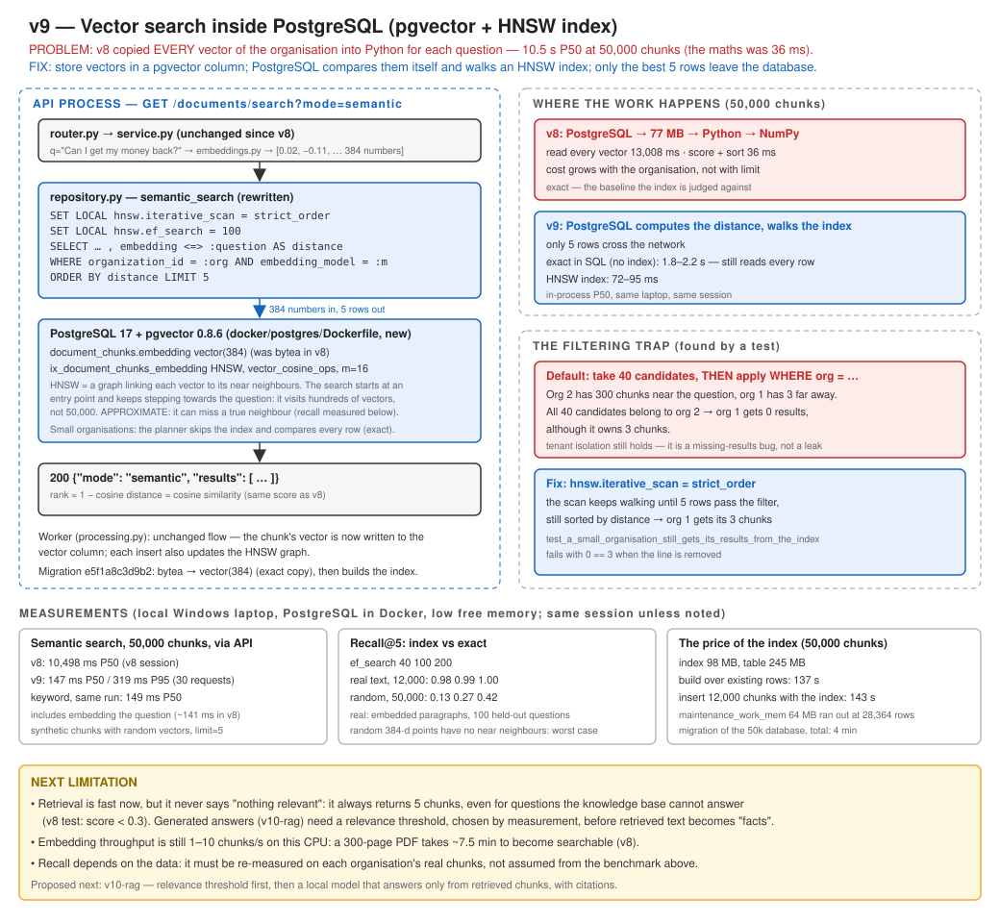

# v9: Vector search inside PostgreSQL

v8 found answers by meaning, but it did so by copying every vector of the organisation out of
PostgreSQL for each question: 10.5 s at 50,000 chunks. v9 stores the vectors in a **pgvector**
column and lets PostgreSQL find the nearest ones itself, through an **HNSW index**, a graph of
nearest neighbours. The API is unchanged. Only the 5 best rows leave the database.



## What this version adds

- `docker/postgres/Dockerfile`: the same `postgres:17-alpine` image, plus pgvector 0.8.6.
- `document_chunks.embedding` becomes `vector(384)`, with an HNSW index for cosine distance. The
  migration converts existing vectors exactly, and it can be reversed.
- `semantic_search` is one SQL query: `ORDER BY embedding <=> :question LIMIT 5`, with the tenant
  filter in the same statement.
- Two settings per search: `hnsw.iterative_scan = strict_order`, so a small organisation is not
  starved by a large one, and `hnsw.ef_search = 100`, for better recall at the same speed.
- `scripts/measure_vector_index.py`: exact search vs the index, for speed and recall.

## Run

Rebuild the database image once. It compiles pgvector, which takes a few minutes and needs network
access. Your data volume is kept:

```bash
docker compose up -d --build db
```

```bash
pip install -r requirements.txt
```

```bash
alembic upgrade head
```

```bash
uvicorn app.main:app
```

```bash
python -m app.worker
```

## Try it

```bash
curl -G http://127.0.0.1:8000/documents/search -H "Authorization: Bearer $TOKEN" --data-urlencode "q=Can I get my money back?" -d mode=semantic
```

Same answer as v8, now computed inside PostgreSQL.

## Test

```bash
pytest -v
```

Worth reading, in `tests/test_vector_search.py`:

- `test_the_search_query_can_use_the_vector_index`: it fails if the query uses a distance the index
  was not built for.
- `test_a_small_organisation_still_gets_its_results_from_the_index`: it fails with `0 == 3` when the
  iterative scan is removed.

## Results (measured locally, on a laptop under memory pressure)

| | v8 | v9 |
|---|---|---|
| Semantic search P50, 50,000 chunks, through the API | 10,498 ms | **147 ms** |
| Same, in-process, same session | 6,476 ms | 72–95 ms |
| Recall@5 vs exact, real text (12,000 paragraphs) | 1.00 (exact) | **0.99** |
| Recall@5 vs exact, random vectors (worst case) | 1.00 (exact) | 0.27 |
| Index size, 50,000 chunks | — | 98 MB |

## Documents

- Full version document: [v9-vector-search.md](../v9-vector-search.md)
- [ADR-025: Search vectors inside PostgreSQL with pgvector and an HNSW index](../../adr/ADR-025-pgvector-hnsw-index.md)
- [ADR-026: Build pgvector into our own PostgreSQL Alpine image](../../adr/ADR-026-build-pgvector-into-the-alpine-image.md)
- Previous version: [v8: Embeddings](../v8-embeddings.md)
